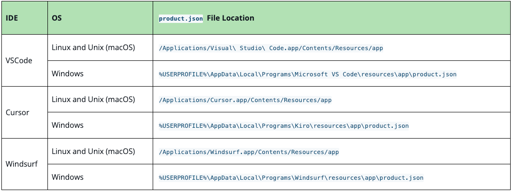
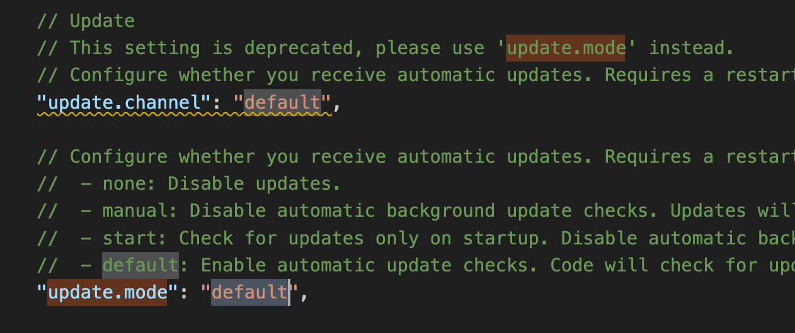
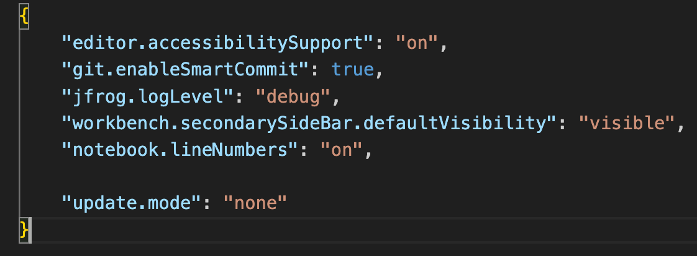
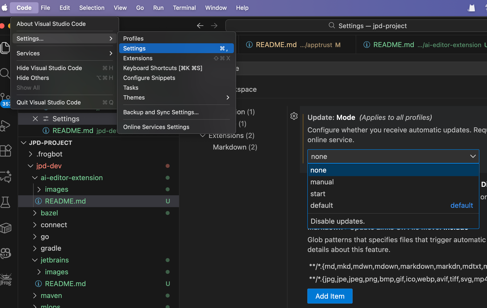
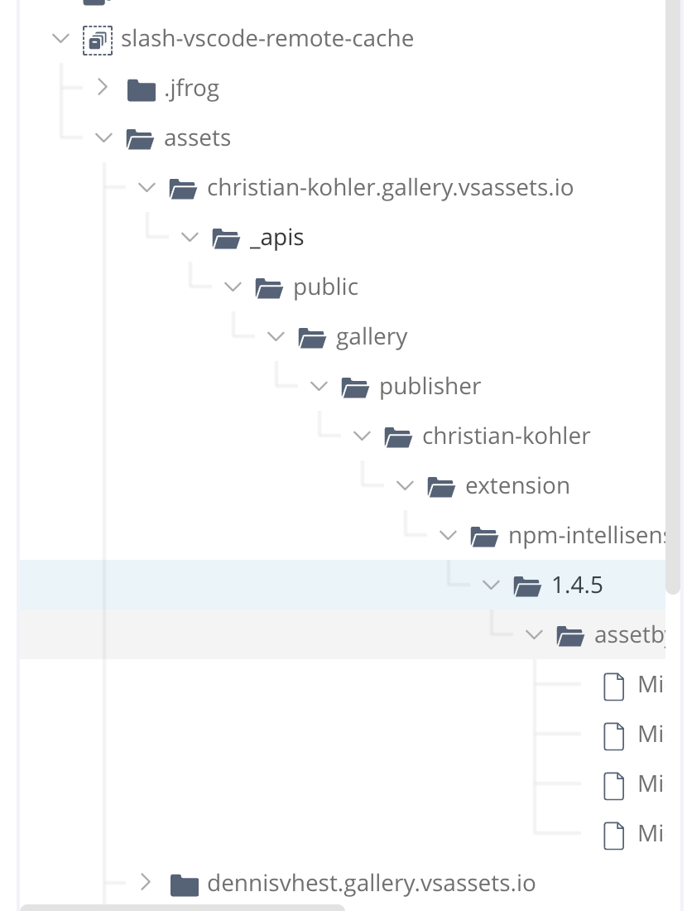

## AI Editor Extension Repositories
功能包含在以下两个安全包中：
- Unified Security
- Ultimate Security bundles


### 操作步骤
#### 1. 创建一个 AI Editor Extensions remote repository


#### 2. 拥有 product.json 编辑权限  
所在目录：


因为这个配置文件非常重要，建议修改前备份。

#### 3. 关闭 IDE 自动更新  
Linux and Unix (macOS): Cmd+Shift+P  
搜索框中输入 setting.json，打开配置文件后，搜 update.mode


修改成 none
```
"update.mode":"none"
```

备注：  
系统级别的 setting.json 可能没有编辑权限，可以尝试用户级别的 setting.json


option 2  
也可以直接通过在 IDE 窗口中设置。按照以下菜单打开设置，输入 update.mode 搜索到配置的属性，选择 none



#### 4. 配置 product.json 连接 Artifactory
```
"extensionsGallery": {
	...
	"serviceUrl":"https://[JFrogPlatformURL]/artifactory/api/aieditorextensions/<REMOTE_REPO_NAME>/_apis/public/gallery",
	...
}
```
重启 IDE

#### 5. 通过 IDE 市场下载
例如搜索 npm Intellisense，下载会通过 Artifactory remote 仓库下载。



#### 6. 限制
- 目前智能匿名访问
- 需要关闭 IDE 市场的自动更新


官方参考 wiki：  
https://jfrog.com/help/r/jfrog-artifactory-documentation/connect-your-ide-to-artifactory

另外 JED 搜索安装 solidity，有恶意包，测试验证，恶意包已被删除，无法重现验证。

