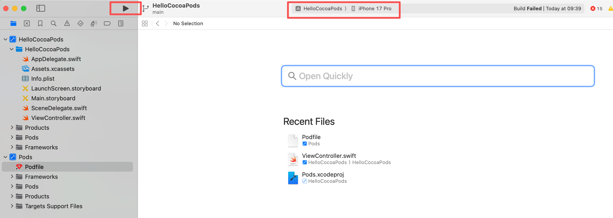
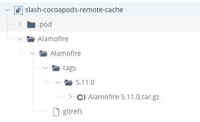
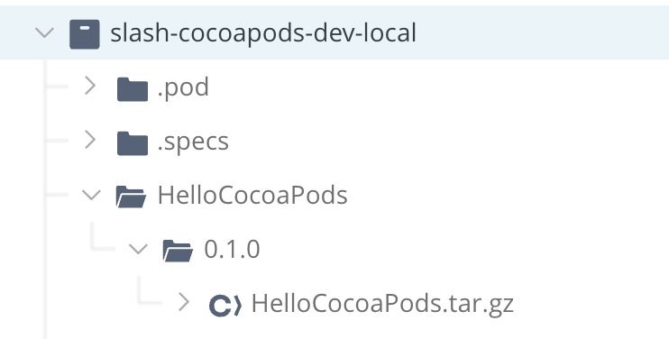

## 1. 概念
CocoaPods 是 Swift 和 Objective-C 项目的依赖管理器。

### 1.1 CocoaPods 核心组成
CocoaPods 外部三方源由 3 个主要部分组成：
- specs - 官方原始中央索引库，里面全是 .podspec 文件（文本文件），记录了每个库的版本号、源码下载地址、编译参数等。 https://github.com/CocoaPods/Specs
- CocoaPods CDN - 基于 Specs 库建立的 内容分发网络（CDN）。它会同步 CocoaPods/Specs 里的内容。现在 pod 默认不再下载整个 Git 库，而是通过这个 CDN 地址，像查字典一样，按需下载你需要的那个库的索引文件。https://cdn.cocoapods.org
- 实际源代码托管在像 GitHub 这样的 Git providers。当索引文件告诉 CocoaPods “AFNetworking 在 GitHub 的某个地址”时，CocoaPods 才会去 GitHub 把真正的代码下载下来。https://github.com/

所以，CocoaPods 实际上是一个去中心化的下载器 + 中心化的索引库。

### 1.2 pod install 流程
第一步：解析 Podfile (Analysing dependencies)
- CocoaPods 读取你项目里的 Podfile，确定你需要哪些库，以及你指定的版本范围。

第二步：寻找索引 (Fetching Specs) —— 涉及 CDN
- CocoaPods 会联系 https://cdn.cocoapods.org  
- 动作： 它会根据你需要的库名（比如 SDWebImage），在 CDN 上搜索对应的 .podspec.json 文件。  
- 结果： 下载到这个库的详细信息（比如：版本 5.0 的代码在 https://github.com/SDWebImage/SDWebImage.git）。  

第三步：解决冲突 (Dependency Resolution)
- CocoaPods 会计算所有库的依赖关系。例如：A 库依赖 B 库，B 库要求 C 库版本 > 2.0。它通过复杂的算法算出所有库都能兼容的具体版本号。
- 计算完成后，生成（或更新）Podfile.lock 文件，锁定版本。

第四步：下载源码 (Downloading dependencies) —— 涉及 GitHub
- 动作： 根据第二步拿到的下载地址（通常是 github.com/...），CocoaPods 调用 git clone 或下载压缩包。
- 这些代码会被下载到你项目根目录的 Pods/ 文件夹下。

第五步：生成/集成工程 (Generating Pods project)
- 动作： 调用 CocoaPods/Xcodeproj 组件，创建一个 Pods.xcodeproj 工程。
- 将下载的代码加入这个工程，设置编译参数（如 Search Paths, Flags 等）。
- 最后，创建一个 .xcworkspace（工作区），把你的主工程和 Pods 工程关联起来。


## 2. 安装环境 & Demo 工程
### 2.1 安装环境
```
brew install cocoapods
pod --version
```
当前 Demo 使用的是 1.16.2

### 2.2 Xcode 创建 Demo 工程
- 打开 Xcode，选择 Create a new Xcode project；
- 选择 iOS -> App，点击 Next；
- 项目名称输入 HelloCocoaPods，确保 Interface 选择 Storyboard 或 SwiftUI（本例以 UIKit 为主），语言选择 Swift；
- 保存项目

### 2.3 操作步骤
在当前工程下创建 Podfile
```
pod init
```

Podfile 中编写需要依赖的组件，执行 install
```
pod install
```

通过命令行执行打开项目
```
open HelloCocoaPods.xcworkspace
```
运行以上命令会在 xcode 中开启工程。

运行结果验证：
- 选择一个模拟器，按下 Command + B 构建，Command + R 运行。
- 查看 Xcode 下方的 Console (控制台)。你会看到来自 Alamofire 的网络响应数据以及我们打印的： 🚀 成功！CocoaPods 依赖包已工作。Hello World!  
（以上 build 和 run 暂时没有成功，报 mac 沙箱权限问题）


## 3. Artifactory Cocoapods
### 3.1 客户端配置
配置认证 ~/.netrc
```
machine <JPD_URL>
login <username>
password <token>
```

### 3.2 添加注册仓库
```
pod repo add-cdn slash-cocoapods-virtual "https://<JPD_URL>/artifactory/api/pods/<cocoapods_repo>"
pod repo list
pod repo remove <repo name>
```

Podfile 添加使用哪个私有仓库（有时候本地可能会配置了多个 repo）
```
source "https://<JPD_URL>/artifactory/api/pods/<cocoapods_repo>"
```

### 3.3 依赖下载
清理所有缓存并重新安装
```
pod deintegrate
pod cache clean --all
```
再手动删除本地缓存目录内容  
~/.cocoapods/repos/<cocoapods_repo>/Specs/  
删除 Podfile.lock  

```
pod install
```

可以看到已经通过 Artifactory 代理下载了依赖组件

### 3.4 部署上传
前提条件：
- Artifactory 的 CocoaPods local 仓库仅支持 .tar.gz pod 文件
- Pod tar 包必须包含 .podspec 或者 .podspec.json 元数据文件

上传命令：
```
curl -L -u <username>:<password> -XPUT "https://<JPD_URL>/artifactory/<cocoapods_local_repo>/HelloCocoaPods/0.1.0/HelloCocoaPods.tar.gz"
```


ResolveCocoapods 工程 Podfile 中引入 HelloCocoaPods

### 3.5 注意事项
cocoapods virtual 仓库只与 CocoaPods CDN 兼容。virtual 仓库中包含的所有本地和远程存储库也必须与 CDN 兼容。


