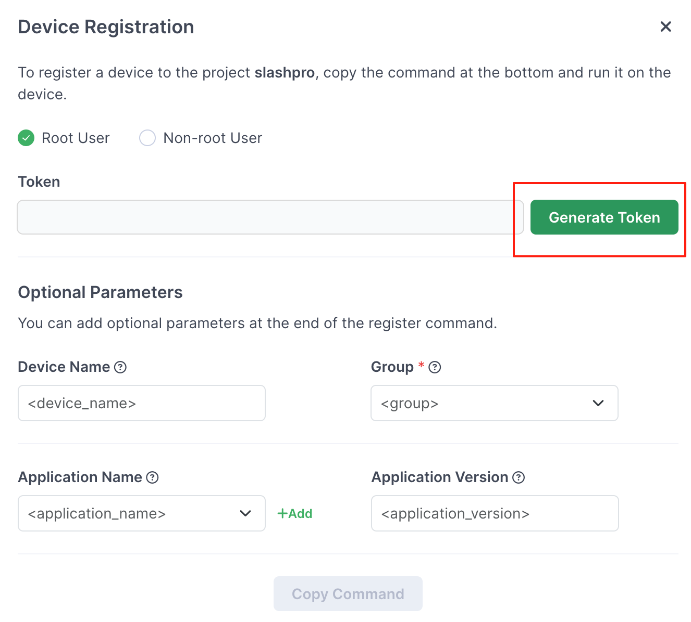
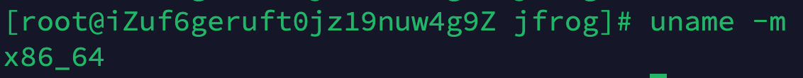

### Agent 安装说明
#### （一） 设备自动注册
connect_agent_install.sh  
1. 脚本作用
自动注册脚本，可以将其初始化放入设备某目录中，设备启动后执行。  

2. 使用场景：  
厂商的设备发送给客户，希望在初始化首次打开后自动注册。  
后续需求，注册后根据设备所在全球所在区域，配置相应的 Project Group 等参数。

3. 脚本说明
脚本会获取当前 mac 地址，作为设备在 Connect 服务的注册名称。（例如： device_00:16:3e:18:e2:b7）  
初始化注册到 ReadyGroup 组中（如有需求可调整设置组逻辑） 
脚本 line 31 -p 参数 token 是通过 JFrog Connect UI 菜单Devices -> Register Device -> Generate token

#### （二）离线部署（还未实操验证）
下载官方安装脚本 connect-installer.sh ：  
https://app.connect.jfrog.io/v2/install_connect

脚本通过在设备上执行 uname -m 获取系统架构，并下载对应的 connect-agent 安装包。

因此我们可以通过执行 uname -m 手动下载对应安装包

wget --header="Authorization: Bearer <token>" "https://app.connect.jfrog.io/download_connect?arch=x86_64a" -O connect.tar.gz

next step（未开发）：  
1. 将手动下载的 connect.tar.gz 初始化到设备目录中；
2. 修改官方安装脚本，将下载安装包部分修改成本地包；
3. 修改 connect_agent_install.sh line 31 读取本地修改后的官方脚本 connect-installer.sh。
4. 设备启动，执行 connect_agent_install.sh

离线安装包内容：  
|- connect.tar.gz  
|- connect-installer.sh  
|- connect_agent_install.sh  

