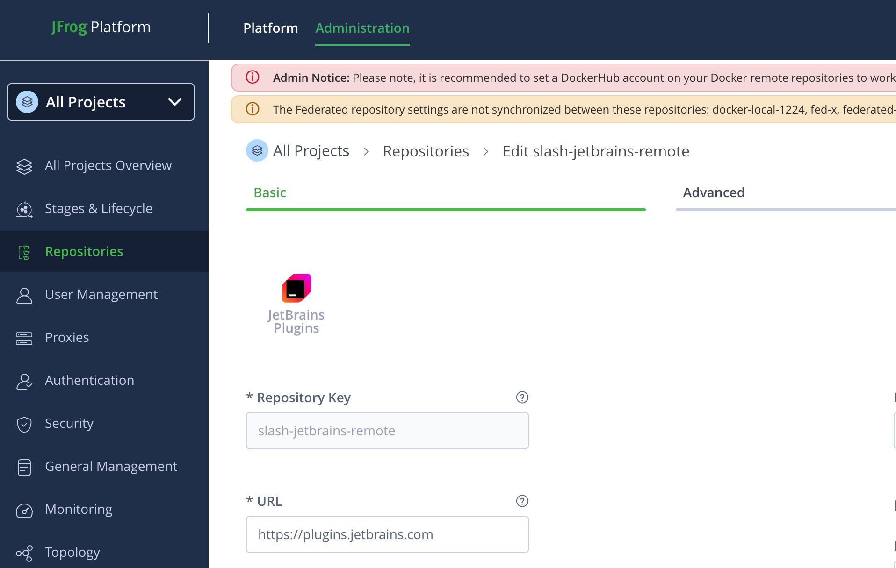
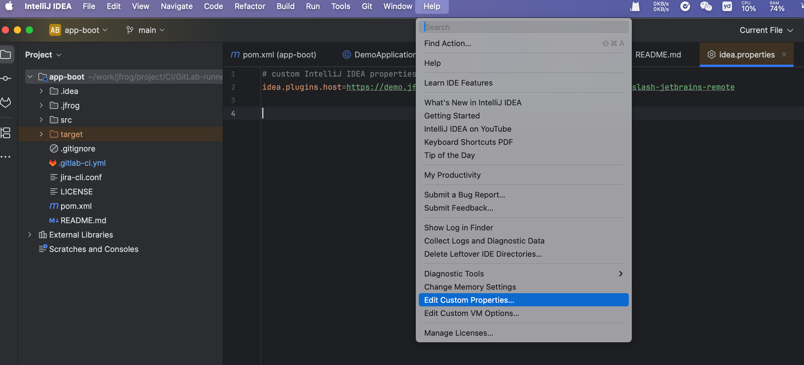
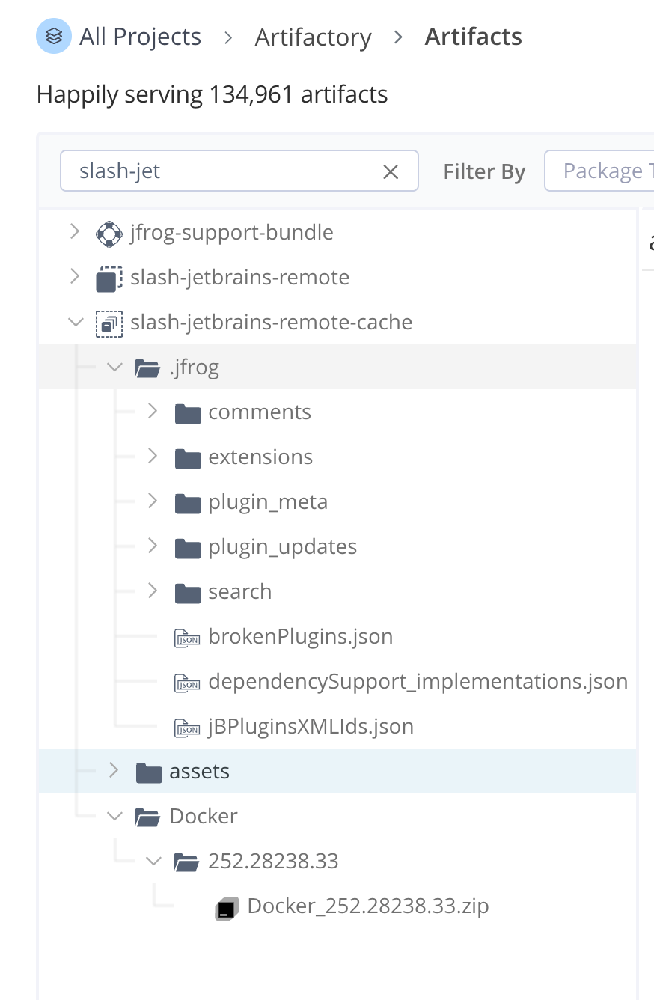

## JetBrains Plugins Repositories
功能包含在以下两个安全包中：
- Unified Security
- Ultimate Security bundles

### 使用步骤
#### 1. 创建 JetBrains remote 仓库



#### 2. Connect JetBrains IDE to Artifactory
IDE Help | Edit Custom Properties  
修改 .properties 文件
```
idea.plugins.host=https://[JFrogPlatformURL]/artifactory/api/jetbrainsplugins/<REPO_NAME>
```


#### 3. 重启 IDE
plugin 安装插件后，插件会被缓存在 remote cache 仓库



