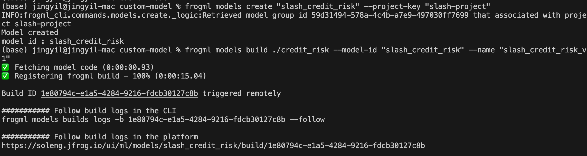

## 上传自定义 model
前置条件：Python versions. 3.9 to 3.11

### 1. 安装 FrogML 客户端
```
pip3 install frogml-cli
```

### 2. 创建 model
```
frogml models create "<MODEL_NAME>" --project-key "<PROJECT_KEY>"
```

通过模版构建 model
```
frogml models init --example general .
```

通过示例构建 model
```
frogml models init --example credit_risk .
```

### 3. Build model
```
frogml models build ./<MODEL_FOLDER> --model-id "<MODEL_ID>"
```



### 4. Deploy model


