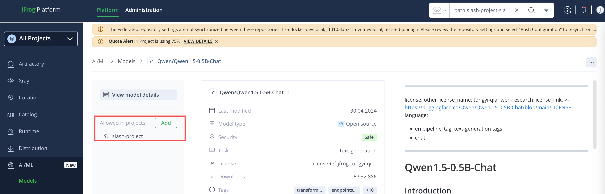

## JFrog ML workshop
llm_finetuning_devops.ipynb 

### 前置条件：
- 创建一个 Project 例如名称为 slash-project
- 

### 操作步骤
#### 逐行执行此 ipynb 文件
- 配置 Configuration 步骤中的 HF_ENDPOINT 等环境变量，使其配置 hugging face 私库下载模型和数据集；
- 第一次执行 Configuration，报错 403（因为下载模型默认不被允许）；
- 通过 AI Catalog 允许下载 model

- 再次执行 Configuration 步骤，通过；

执行完成成功后，调参后的 model 上传至 JPD

