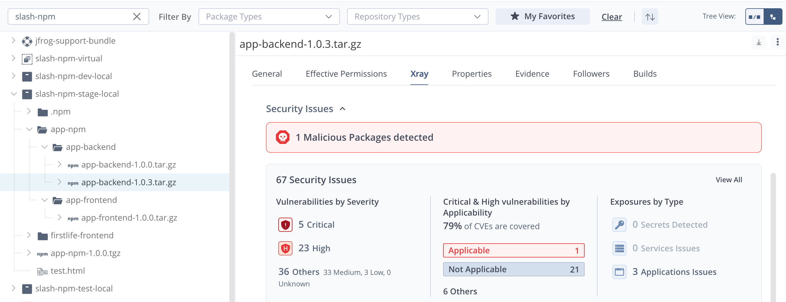
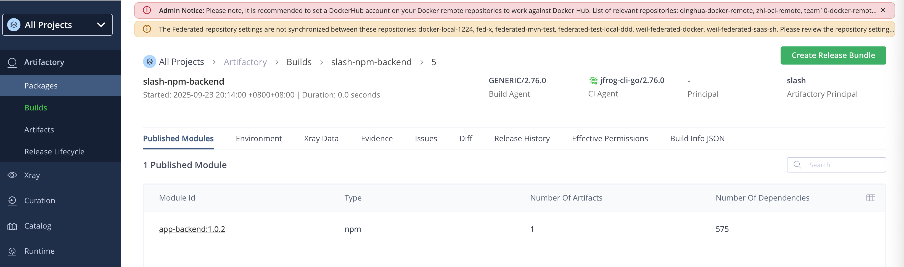
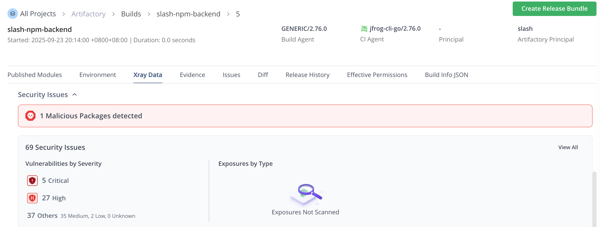
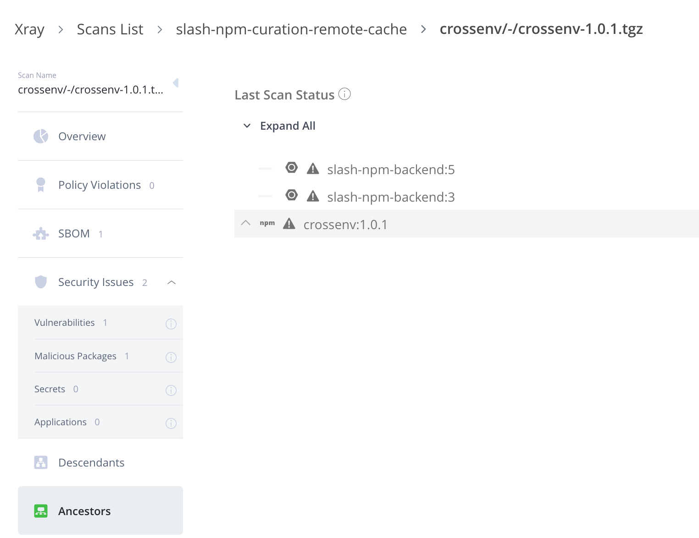
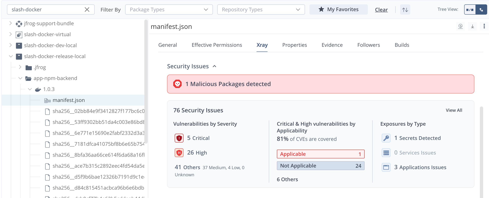

## npm 前后端工程示例
### 1 工程结构说明
```
app-npm/
├── backend/
│   ├── package.json
│   ├── server.js
│   └── .gitignore
├── frontend/
│   ├── package.json
│   ├── index.html
│   ├── src/
│   │   └── main.js
│   └── vite.config.js
├── README.md
└── deploy-scripts/
    ├── build-frontend.sh
    └── build-backend.sh
```

### 2 安装运行
#### 2.1 安装后端依赖
```
cd backend
npm install
```

#### 2.2 启动后端服务
```
npm start
```

### 2.3 安装前端依赖
```
cd frontend
npm install
```

#### 2.4 启动前端开发服务
```
npm run dev
```

### 2.5 访问应用
前端: http://localhost:3000  
后端API: http://localhost:3001

### 3 构建生产版本发布包
执行以下构建脚本前需安装配置好 jf  
脚本中的发布仓库和版本号自行更改
```
# 构建前端
# 执行 npm install build 等构建命令，后将完整目录包括 dist 一并打包上传到 Artifactory 制品仓库
./deploy-scripts/build-frontend.sh

# 构建后端  
# 执行 npm install 构建命令，后将完整目录包括 node_modules 一并打包上传到 Artifactory 制品仓库
./deploy-scripts/build-backend.sh
```

通过将所有依赖包一并打包的方式，可以扫描出安全漏洞问题


### 4 JFrog build
以 backend 后端工程为例
```
cd backend
jf npm install --build-name=slash-npm-backend --build-number=5
jf npm publish --build-name=slash-npm-backend --build-number=5
jf rt bp slash-npm-backend 5
```

通过 jf npm build 的方式也可以构建并扫描 npm 漏洞组件



这种方式可以通过依赖的漏洞组件反向查找 npm 制品


### 5 Docker build 
以 backend 后端工程为例，将其构建后打成 docker image
```
cd backend

docker build -t app-npm-backend:1.0.3 .

docker tag app-npm-backend:1.0.3 demo.jfrogchina.com/slash-docker-release-local/app-npm-backend:1.0.3

docker push demo.jfrogchina.com/slash-docker-release-local/app-npm-backend:1.0.3
```



### 小结
- npm install deploy  
这种方式由于没有打包依赖组件相关信息，所以无法扫描出漏洞
- JFrog npm build 方式和 docker image 方式可以扫描
- npm 反向查找定位只能通过 build 方式
