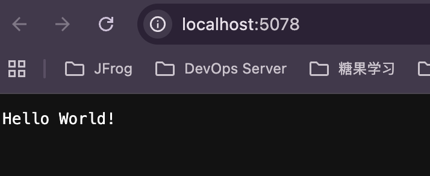

## ASP.net Demo
### 初始化工程

```
dotnet new web -n AppAspNet

dotnet add package Swashbuckle.AspNetCore

dotnet build
dotnet run
```

http://localhost:5078



```
# 构建打包 nupkg 到本地
dotnet pack -c Release -o ./package

# publish 成发布目录，可以直接放到 IIS 环境部署
dotnet publish -c Release -o ./publish

# Deploy nupkg to Artifactory nuget local repo
dotnet nuget push AppAspNet.1.0.0.nupkg --api-key --source Artifactory push slash-nuget-dev-local -s ArtifactoryLocal
```


