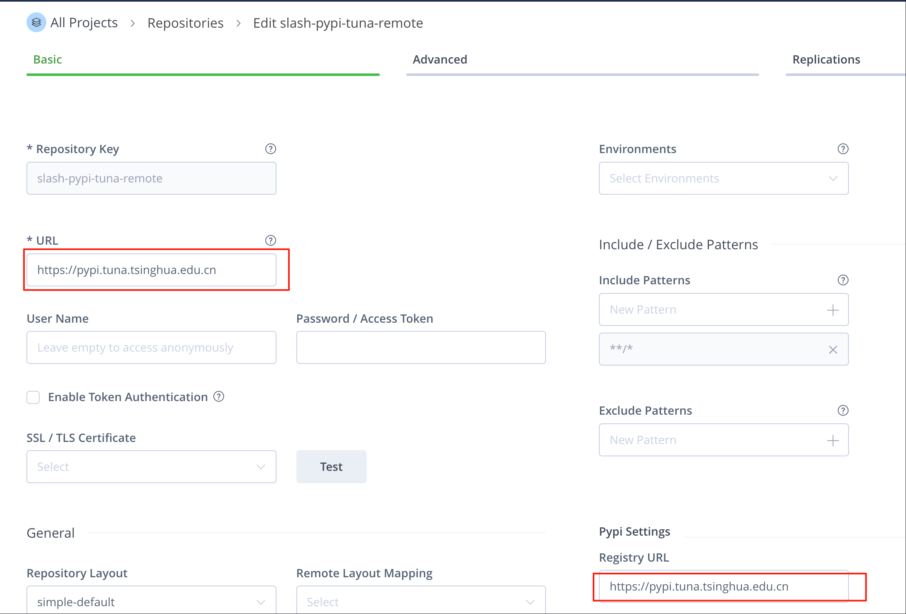
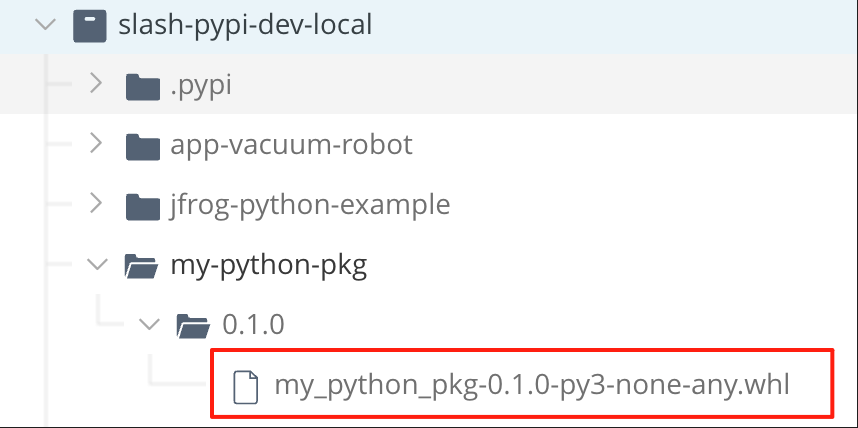
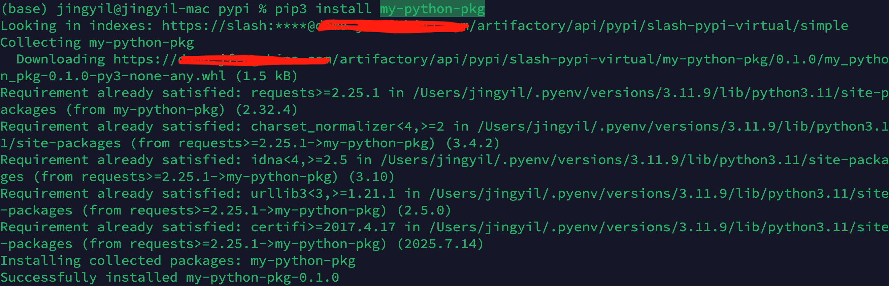
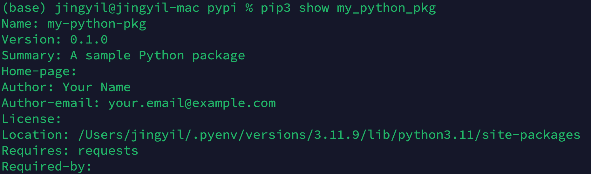

## Artifactory Pypi Repo
slash-pypi-virtual  
slash-pypi-tuna-remote --> https://pypi.tuna.tsinghua.edu.cn   
  
slash-pypi-dev-local 

## 安装相关工具
```
pip3 install setuptools wheel twine
```

## 构建 wheel 包
```
python setup.py bdist_wheel
```
生成的 .whl 文件会在 dist/ 目录下

## 上传到 Artifactory
 home 目录创建 .pypirc 配置文件
 ```
[distutils]
index-servers = slash-pypi-virtual
[slash-pypi-virtual]
repository: https://<jpd-url>/artifactory/api/pypi/slash-pypi-virtual
username: <user name>
password: <password>
 ```

使用 twine 上传
```
twine upload --repository artifactory dist/*.whl
```

上传成功


## 从 Artifactory 依赖下载
```
pip3 install my-python-pkg
```



```
pip3 show my-python-pkg
```


## 卸载本地包
```
pip3 uninstall my-python-pkg.whl

# 清除 pip cache
pip3 cache purge
```


