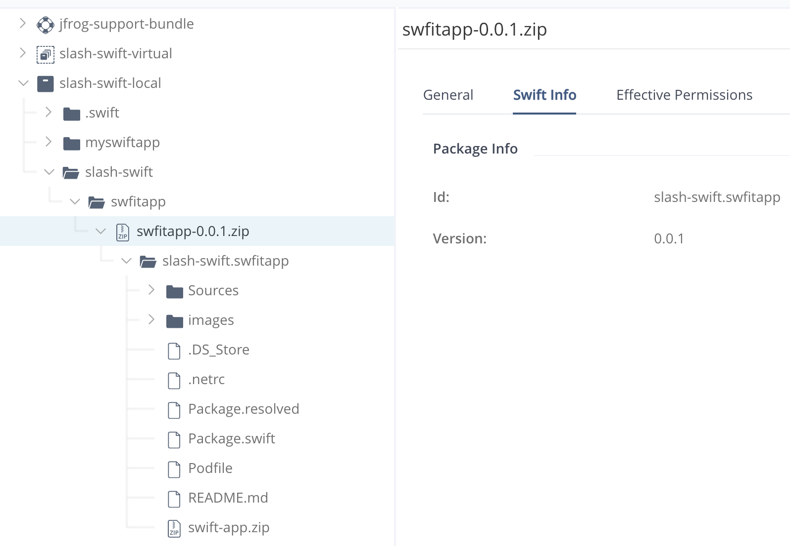
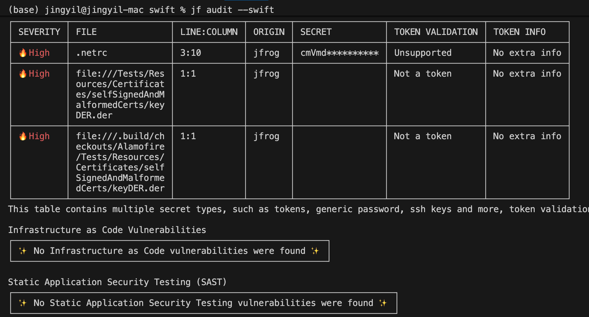

## Swift
### 1 Demo 结构
swift
├── Package.swift
├── Sources/
│   └── swiftapp/
│       └── main.swift
│       └── VulnerableCode.swift
└── README.md

### 2 JFrog Artifactory Swift
#### 2.1 Resolve（没成功）
Swift 目前没有官方的中央源，https://swiftpackageregistry.com 只是 UI 浏览地址。  
Artifactory Swift remote 可以代理 github 仓库。

swift package-registry login https://<JPD_URL>/artifactory/api/swift/<repo_name> \
    --username <usename> \
    --password <password>

#### 2.2 Deploy
按照 setme up 操作即可
```
例如：
swift package archive-source

swift package-registry publish slash-swift.swfitapp 0.0.1
```



### 3 扫描
jf audit --swift


#### 3.1 troubleshooting


