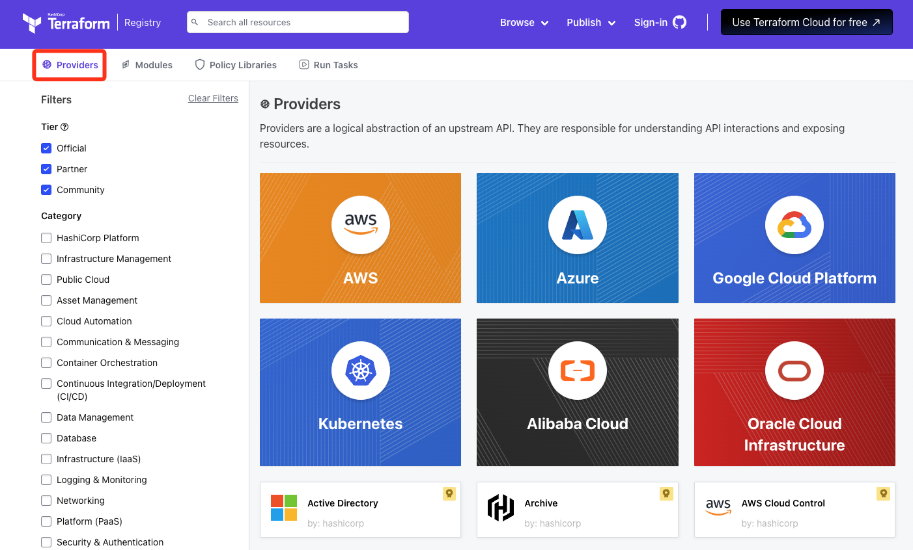
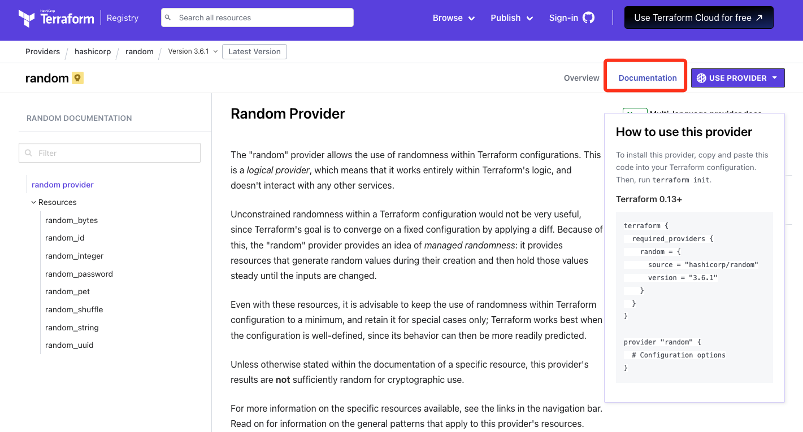

## Terraform 入门使用介绍
### 核心概念
Terraform 是一种基础设施即代码（Infrastructure as Code）工具，旨在帮助开发人员和运维团队自动化基础设施的创建、管理和部署。使用 Terraform，可以通过编写简洁的代码来定义和配置云端基础设施，而不必手动操作和配置
Terraform 的核心概念是“资源”和“提供者（Providers）”。资源代表基础设施中的一项资源，如计算、存储、网络等，而提供者则是由云服务提供商进行开发的插件。

### 使用流程
#### 1. 通过以下官网搜索各种 Providers
https://registry.terraform.io/browse/providers

#### 2. 参考 Providers Documentation
每个 Provider 都有它的操作文档，根据文档一步步编写使用即可

#### 3. 基本命令
terraform init  
terraform plan  
terraform apply  

