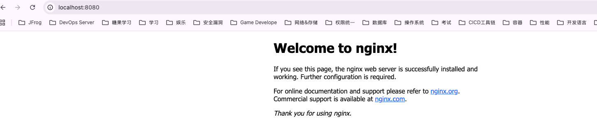

## Terraform Docker
### 1. code structure
```
docker
├── main.tf
├── variables.tf
└── outputs.tf
```

### 2. Quick start
main.tf 主文件

初始化项目，这会下载所需插件，允许 Terraform 与 Docker 进行交互。
```
terraform init
```

预配 NGINX 服务器容器。当 Terraform 要求您确认时。请输入 yes
```
terraform apply
```

查看容器
```
docker ps
```

访问 NGINX 容器进行验证
```
curl -i http://localhost:8080
```




若要停止容器，请运行以下命令并输入yes确认
```
terraform destroy
```

OK 现在已经使用 Terraform 配置并销毁了 NGINX 服务。


### 3. 参数
#### 3.1 入参
variables.tf
- 定义了名为 container_name 的入参；
- main.tf 中通过 name  = var.container_name 引用此入参；

```
terraform apply
```

#### 3.2 出参
outputs.tf
- 获取 docker_container id
- 获取 docker_image id

```
terraform apply
```


### 4. 其它常用命令
```
# 建议在所有配置文件中使用一致的格式。terraform fmt命令自动更新当前目录中的配置，以提高可读性和一致性。
terraform fmt

# 语法验证
terraform validate

# 检测当前状态
terraform show

# 列出资源
terraform state list
```


### 5. 使用 JFrog Terraform Backend
1. 首先创建一个符合前缀命名规则的工作区
```
terraform workspace new slash-terraform-docker-demo
```

2. 或者列出可用的工作区
```
terraform workspace list
```

3. 选择现有的工作区
```
terraform workspace select slash-terraform-你的工作区名称
```

4. 重新初始化
```
terraform init

```

