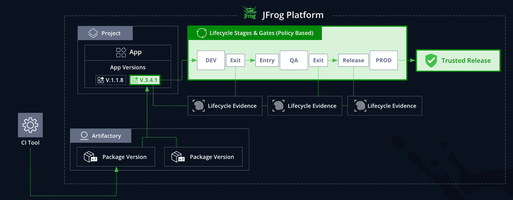

## AppTrust

AppTrust license

AppTrust 逻辑架构


### Quickstart
- step 1 项目

- step 2 创建维护 Stages（全局 和 项目级）

- step 3 指定仓库为对应的 Stages

- step 4 编辑 Lifecycle，组合 Stages  
    【Administrator】->【Stages & Lifecycle】

- step 5 AppTrust 菜单创建 application  
    application key 名称系统全局唯一.  
    application 必须是基于 project 创建.  
    
- step 6 绑定 package 到 application  
    API 方式：https://jfrog.com/help/r/jfrog-rest-apis/bind-package-version  
    OIDC integration：Demo 工程  
    https://github.com/slash-l/jpd-github

- step 7 维护 application version.   
    jf version 2.81.0+  
    build release-bundle application 三选一  
    ```
    # 创建 application 版本
    jf apptrust version-create slash-application v1.0 --source-type-builds="name=slash-build-maven,id=1"

    # 修改 application(tag 或者 properties，不能修改版本号)
    jf apptrust version-update slash-application v1.0 --tag="slash-test-tag"
    ```

    

- step 8 Lifecycle Policies  
    针对每个 stage 可以配置 entry 和 exit 两种 policy 作为门禁。  
    权限要求：Admin 或者 Project Admin


问题：  
- PROD stage 不可更改，但是貌似只有 Global 没有 Project 级别
- 项目级别的 rbv2 dashboard 为什么显示了全局的 stage？
- 创建 application level policy 在 lifecycle 中不现实，无效（估计是 bug）
- 绑定 package 的意义在哪里，因为貌似通过 application 的版本就可以使用了。
- artifact 如何绑定？如何客户不用 package 怎么办？
- Application -> Insights 数据怎么来的
- 一个 project 只能配置一个 lifecycle 流水线是吗？


### Evidence
[JFrog Evidence](evidence.md)


JFrog AppTrust workshop
```
Version Created
      ↓
┌─────────────────┐
│   DEV Entry     │ → Unit Tests? → FAIL if missing → BLOCKED
│   Gate          │ → Critical CVE? → WARN if present → Proceeds
└─────────────────┘
      ↓ (if pass)
┌─────────────────┐
│   DEV Stage     │ (Version in DEV, developers working)
└─────────────────┘
      ↓ (attempt promotion)
┌─────────────────┐
│   DEV Exit      │ → Critical CVE? → FAIL if present → BLOCKED
│   Gate          │
└─────────────────┘
      ↓ (if pass → auto-generates DEV Exit Certification)
┌─────────────────┐
│ STAGING Entry   │ → DEV Exit Cert? → FAIL if missing → BLOCKED
│   Gate          │
└─────────────────┘
      ↓ (if pass)
┌─────────────────┐
│ STAGING Stage   │ (QA team testing)
└─────────────────┘
      ↓ (attempt promotion)
┌─────────────────┐
│ STAGING Exit    │ → QA Evidence? → FAIL if missing → BLOCKED
│   Gate          │
└─────────────────┘
      ↓ (if pass → auto-generates STAGING Exit Certification)
┌─────────────────┐
│ RELEASE Entry   │ → STAGING Cert? → FAIL if missing → BLOCKED
│   Gate          │ → Release Approval? → FAIL if missing → BLOCKED
└─────────────────┘
      ↓ (if pass)
┌─────────────────┐
│ RELEASE Stage   │ 🏆 TRUSTED RELEASE BADGE!
└─────────────────┘
```


