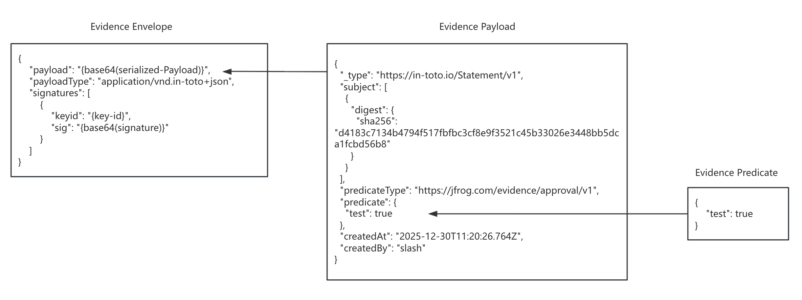
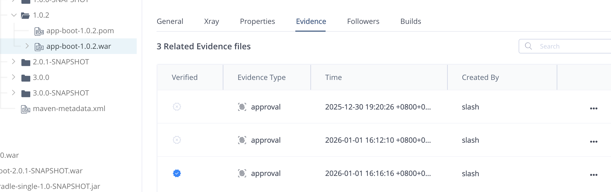

## 1 创建 Evidence
例如：
```
jf evd create \
--subject-repo-path slash-maven-dev-local/com/example/jfrog/app-boot/1.0.2/app-boot-1.0.2.war \
--key ~/jpd-evidence-key/evidence.key \
--key-alias evd-key-20251230-150302 \
--predicate predicate.json \
--predicate-type https://jfrog.com/evidence/approval/v1 \
--provider-id maven
```

Evidence Files 包含多个层：
- Evidence Predicate
- Evidence Payload
- Evidence Envelope



## 2 查看 Evidence

- 以上创建命令种如果不加 --key-alias 参数，则会被认为未被验证。--key-alias 上传到 Artifactory 后的公钥名称
- Evidence Type == 创建时 --predicate-type 参数 https://jfrog.com/evidence/approval/v1 中的 approval 部分，可自定义

CLI 获取 evidence
```
jf evd get --subject-repo-path slash-maven-dev-local/com/example/jfrog/app-boot/1.0.2/app-boot-1.0.2.war --output app-boot-1.0.2-evidence.json
```
以上命令获取完整的 Envelope

## 3 验证 Evidence
```
jf evd verify --subject-repo-path slash-maven-dev-local/com/example/jfrog/app-boot/1.0.2/app-boot-1.0.2.war --public-keys evidence.pub 
```

## 4 删除 Evidence
目前只支持 api 方式删除
```
DELETE /{{artifactory-host}}/evidence/api/v1/evidence/{subject-repo-path}/{evidence-name}

例如：
{{baseURL}}/evidence/api/v1/evidence/slash-maven-dev-local/com/example/jfrog/app-boot/1.0.2/app-boot-1.0.2.war/approval-1767093627053-04c5a30c.json
```
evidence-name：下载 Evidence 的名称

