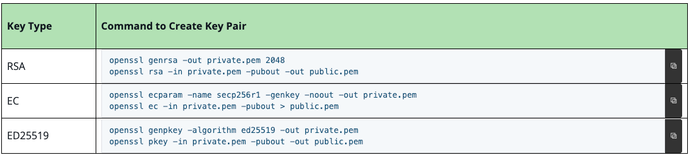
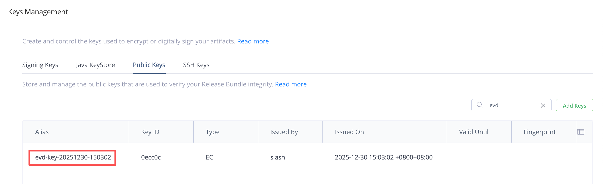

## Evidence
### 1 版本要求
- Artifactory 7.104.2+
- 收集由 Artifactory 和 Xray 生成的内部数据需要 ProX
- 用户将外部证据附加至 Artifactory 相关对象，需要 E+

### 2 概念（TBD）
JFrog 平台使用 in-toto 验证标准来生成 evidence。该标准要求创建一个 DSSE envelope，其中包含加密并签名后的 evidence。

evidence - signed metadata（attestation）
可创建 evidence 的对象
- Artifacts
- Packages
- Builds
- Release Bundles v2


Artifactory 允许为特定对象（如 artifact\build、package 或 Release Bundle v2）附加证据（已签名的元数据）。这些证据文件起到了证明文件的作用，为对所述对象执行的外部操作（例如测试结果、漏洞扫描和官方批准）提供了一份经过签名和验证的记录。


方式：
REST API
JFrog CLI


### 3 实现步骤
#### 3.1 创建一个 key pair
生成 key pair 命令


也可以通过 JFrog CLI 生成 key pair，版本要求 CLI 2.82.0+
```
jf evd generate-key-pair
```
默认生成后 public key 会自动上传到 Artifactory，名称 evd-key-YYYYMMDD-HHMMSS，可以通过参数修改。


--upload-public-key=false 不自动上传 Artifactory


#### 3.2 上传 public key 到 artifactory
通过 UI  
【Security】 > 【Keys Management】

通过 API  
```
POST /artifactory/api/security/keys/trusted
```

#### 3.3 Evidence 创建 查询 验证
3 种方式
- [JFrog CLI](./CLI.md)
- [JFrog Rest Api](./API.md)
- [JFrog DSSE](./DSSE.md)


