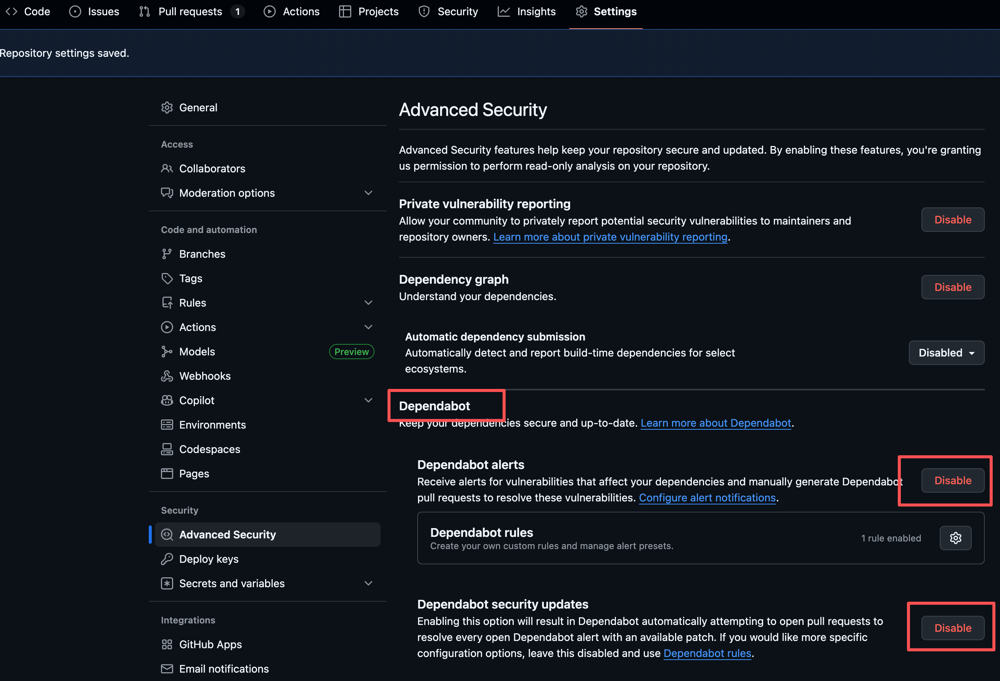

# 1. CI
## 1.1 JFrog Job Summary
GitHub Actions 中点击某个 build 详情，点击 Summary，会出现 JFrog Job Summary

备注：  
只有执行了相关的 JFrog 交互操作，才会显示。例如 build scan 等等，具体参考 Demo 工程


## 1.2 Evidence
GitHub Evidence 参考：  
https://github.com/actions/attest-build-provenance

action.yaml 官方说明
```
- uses: actions/attest-build-provenance@v3
  with:
    # Path to the artifact serving as the subject of the attestation. Must
    # specify exactly one of "subject-path", "subject-digest", or
    # "subject-checksums". May contain a glob pattern or list of paths
    # (total subject count cannot exceed 1024).
    subject-path:

    # SHA256 digest of the subject for the attestation. Must be in the form
    # "sha256:hex_digest" (e.g. "sha256:abc123..."). Must specify exactly one
    # of "subject-path", "subject-digest", or "subject-checksums".
    subject-digest:

    # Subject name as it should appear in the attestation. Required when
    # identifying the subject with the "subject-digest" input.
    subject-name:

    # Path to checksums file containing digest and name of subjects for
    # attestation. Must specify exactly one of "subject-path", "subject-digest",
    # or "subject-checksums".
    subject-checksums:

    # Whether to push the attestation to the image registry. Requires that the
    # "subject-name" parameter specify the fully-qualified image name and that
    # the "subject-digest" parameter be specified. Defaults to false.
    push-to-registry:

    # Whether to create a storage record for the artifact.
    # Requires that push-to-registry is set to true.
    # Requires that the "subject-name" parameter specify the fully-qualified
    # image name. Defaults to true.
    create-storage-record:

    # Whether to attach a list of generated attestations to the workflow run
    # summary page. Defaults to true.
    show-summary:

    # The GitHub token used to make authenticated API requests. Default is
    # ${{ github.token }}
    github-token:
```

# 2. Security
## 2.1 JFrog for GitHub Dependabot
GitHub Dependabot is a tool for identifying vulnerabilities in source code dependencies, but it can often generate a high volume of security alerts, making it challenging for developers to prioritize fixes. The JFrog integration with GitHub Dependabot is designed to solve this problem by cutting through the noise, analyzing each vulnerability's context and exploitability, and helping you focus on what truly matters.

GitHub UI setting 打开此功能


（实操未成功）

## 2.2 GitHub Advanced Security
GitHub public repo 可以免费使用


# 3. Copilot


