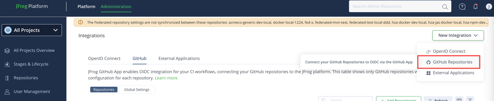
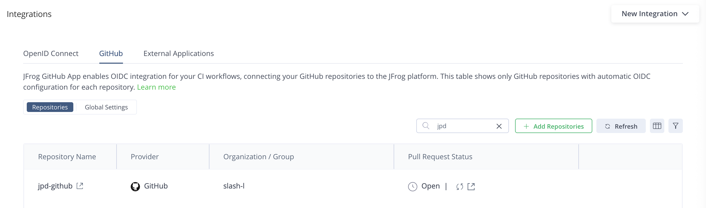
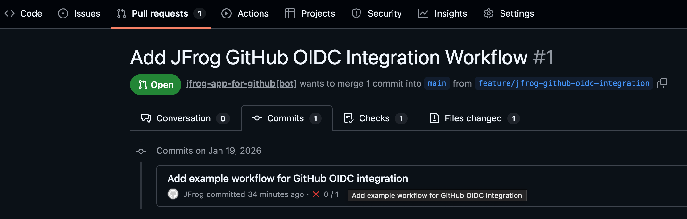
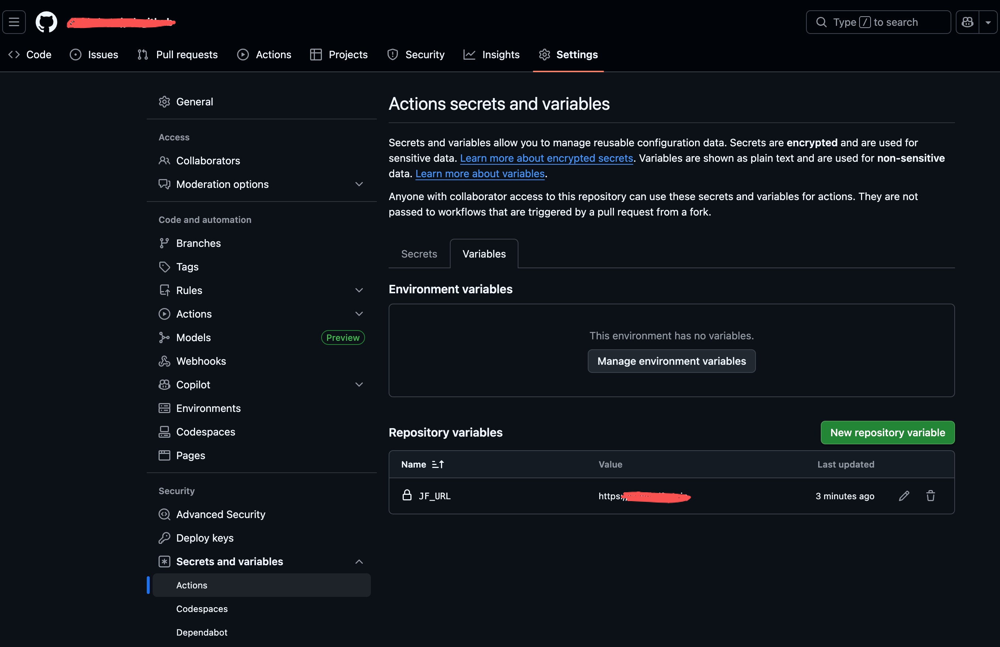
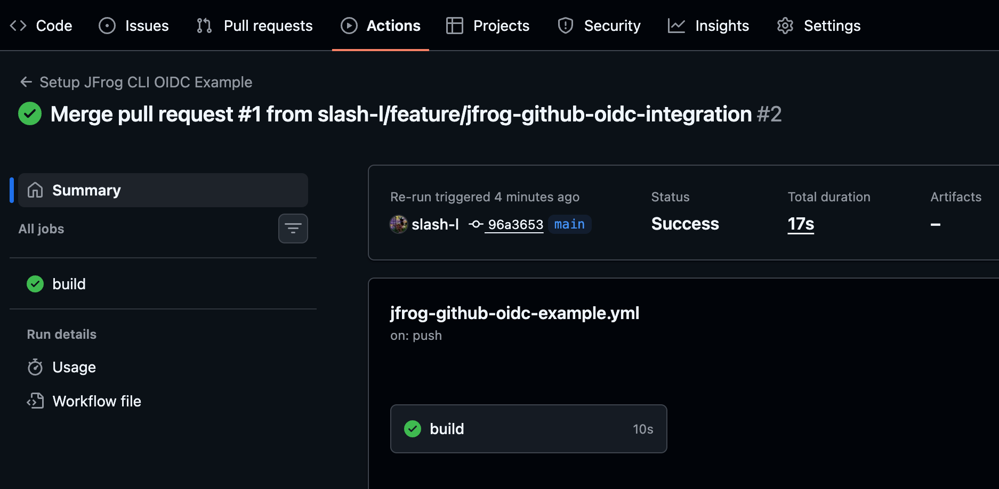
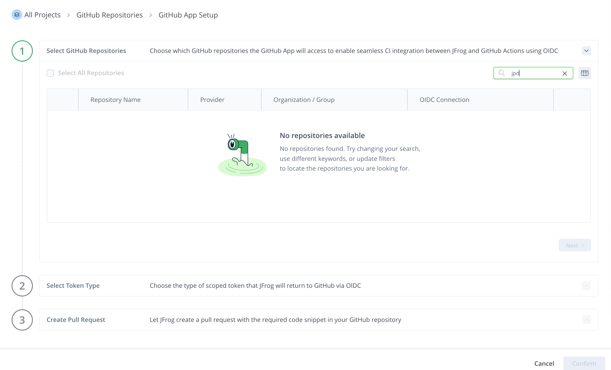
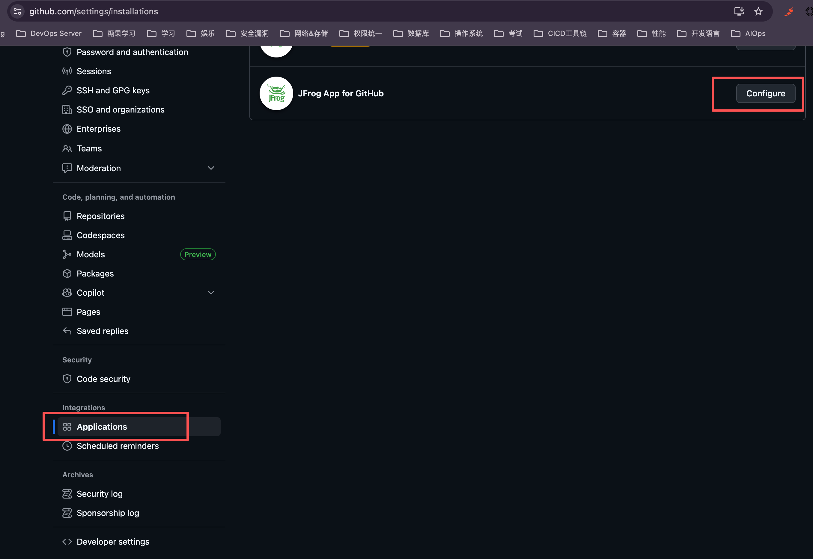
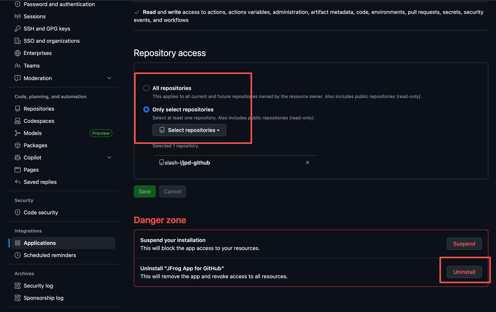
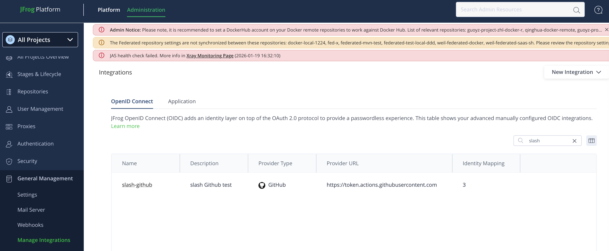

# 1. Access 集成
两种方式集成：
- GitHub App 和 GitHub Actions 
- 可以理解为前者方式自动生成后者生成的内容，即生成 GitHub Actions yaml 中 JFrog 认证，无需用户自己编写
- 通过这两种方式的好处是，无需在 GitHub 中配置 JFrog token 信息

Demo 工程地址：  
https://github.com/slash-l/jpd-github

## 1.1 GitHub App 方式
- JFrog GitHub App 能将 GitHub 仓库与 JFrog 平台进行连接
- 实现 GitHub Actions CI 工作流程的 Artifactory OpenID Connect 集成
- 只支持 JFrog Saas

### 1.1.1 安装配置
通过以下功能菜单添加 Github App 配置，配置过程可以选择哪些 GitHub 仓库和 JFrog Artifactory 集成。

集成配置成功后，【GitHub tab】列表显示每个 OpenID Connect 配置已就绪的 GitHub 仓库。

可以自动或手动方式创建 pull requests，自动创建了 GitHub Actions 的 yaml 文件

GitHub Actions 配置环境变量

GitHub Actions 流水线运行成功。

备注：
- 目前测试下来，只有 public 仓库可以集成
- 仓库列表的搜索功能有 bug，搜索不了结果

参考：  
https://jfrog.com/help/r/jfrog-platform-administration-documentation/configure-jfrog-oidc-integration-with-github-app

### 1.1.2 修改、卸载集成的配置
可以通过 GitHub 以下功能菜单调整权限和删除集成的配置。  
Github 主页 ->【Applications】

## 1.2 GitHub Actions 方式
这种方式支持 On-prem  
Artifactory V7.90+

【General Management】->【Manage Integrations】  

