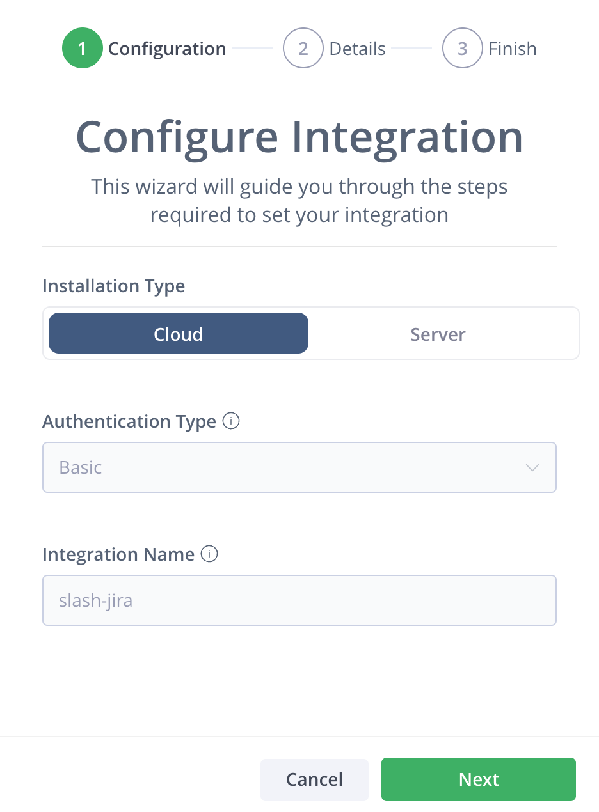
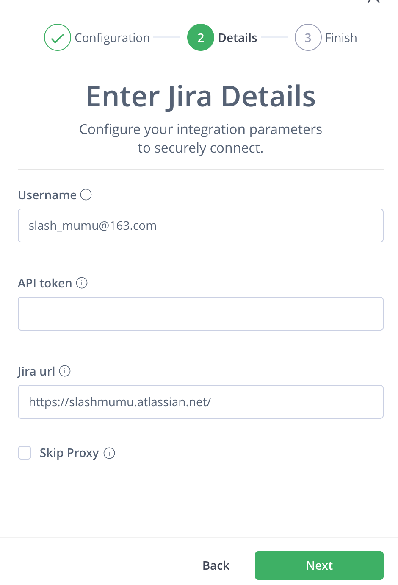
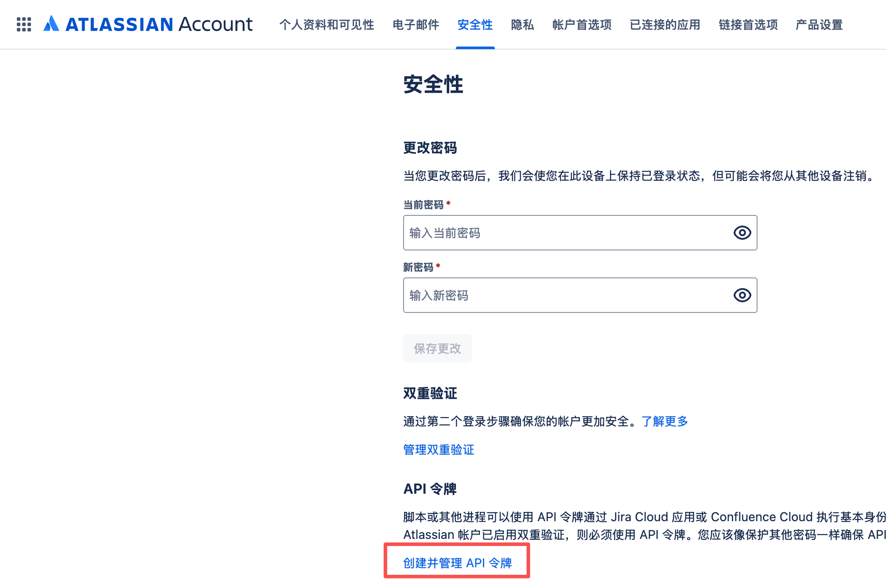
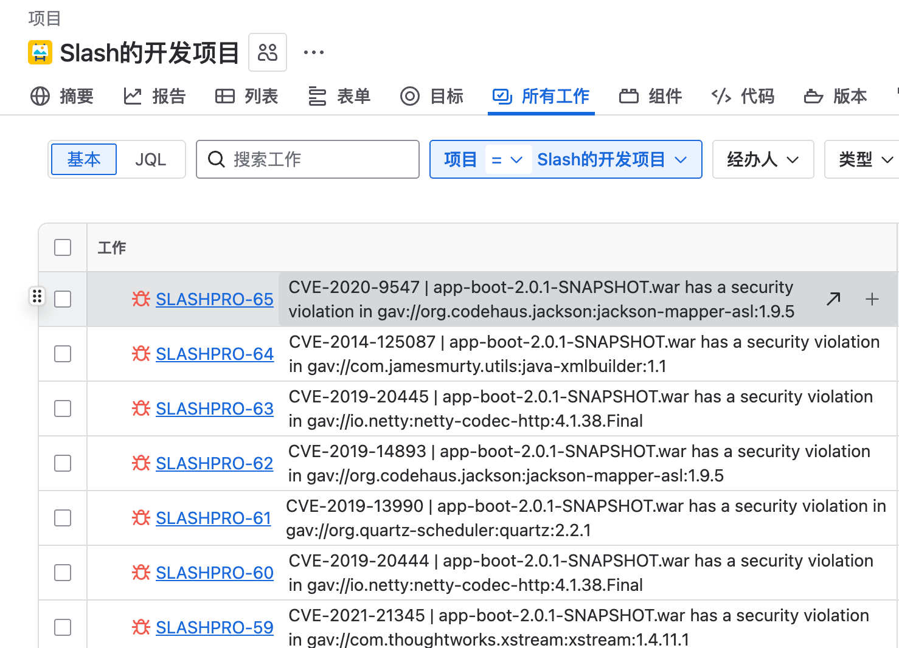
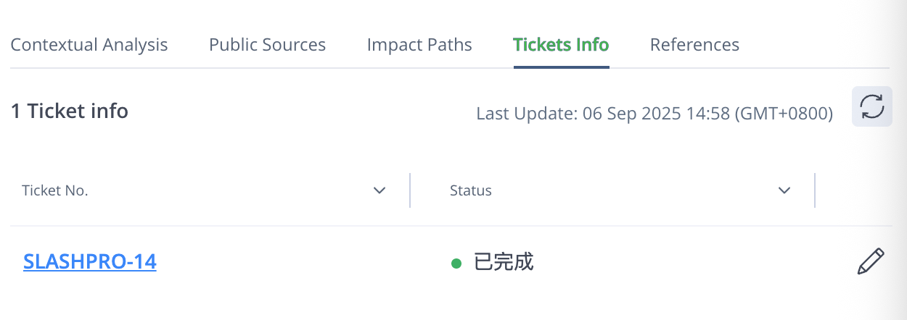
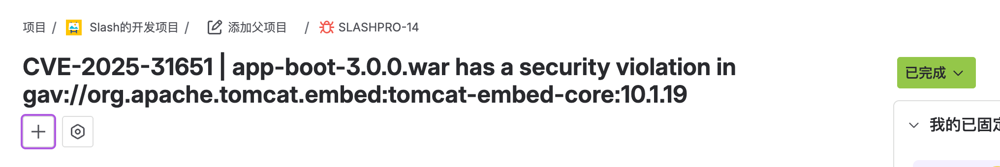
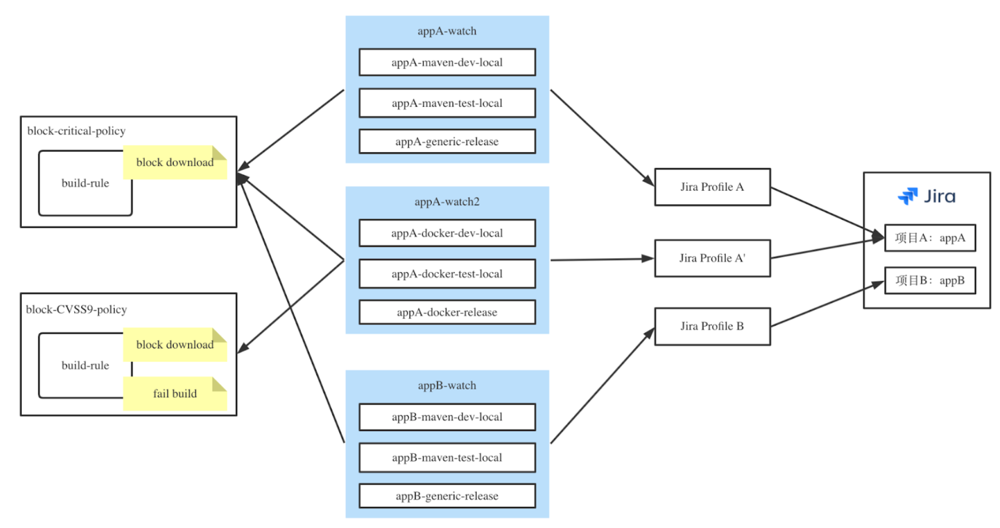

## JFrog Xray 集成 Jira
JFrog Xray offers two Jira integration options: the Native Jira Integration and the JFrog Security Jira Plugin (JSP).   
JFrog is retiring the JFrog Security Jira Plugin (JSP) to streamline Jira integration approach.  
The native Jira Integration offers automatic ticket creation, policy mapping, ticket retrieval, and deduplication.  

### 1. 配置 Jira 服务
【Administration】->【Xray Settings】->【Integrations】
点击页面按钮 Add Jira Integration  
按照以下图例填写：

Jira API token  
通过 Jira 账户 “安全性” 选项中 “API 令牌” 创建

### 2. 配置 Jira profile
根据 UI 界面操作

### 3. 配置 Xray policy watch
根据 UI 界面操作

### 4. 效果
Jira 自动创建 ticket  

Xray Violations 中会显示 Jira tickets  
可以给 ticket Add Comment  
Jira 中更新 ticket 状态，Xray 也会同步。

### 5. 最佳实践
- 我们可以根据 Jira 中的各个项目对应设计一套对应的制品仓库；
- 不同的项目制品仓库可以配置不同的策略和 watch；
- 配置多个 Profile，对应相应的 watch

