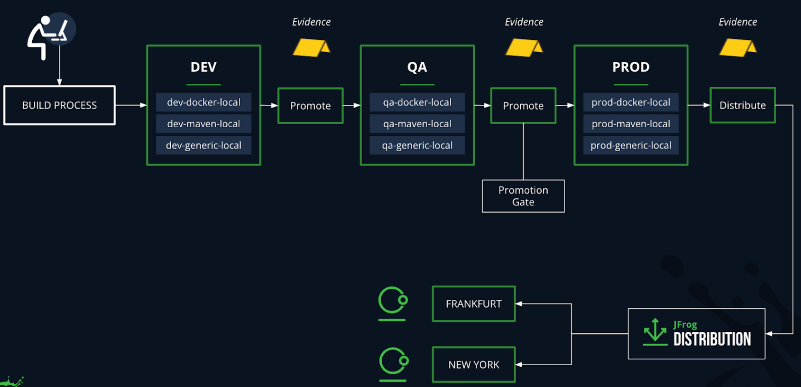

## 发布单元（release bundles v2）
### 管理软件发布的挑战
- Tracking the progress of your release  
- Controlling the contents of your release  
- Keeping the release candidate free from vulnerabilities and other types of tampering  
- Identifying which releases are ready for production

### 方法论：Release First  
发布单元（release bundles v2）一个不可变的安全的 SBOM 软件发布组合版本包
- 多种创建方式
- 签名
- 不可变，阻止从 release bundle 存储库中删除/移动二进制文件
- 只能修改 metadata

一旦获得了发布包，就拥有了一个经过保护的待发布版本，可以在此基础上继续进行发布验证阶段，同时对其保持信任。

步骤

创建环境 Environments（全局、项目）

创建仓库

集成 CI

PROMOTION  
It also supports promoting multiple package types in one release bundle, it is kept as traceable evidence, and allows approval gates every time we perform a promotion. The approval gates can stop the action from happening.

