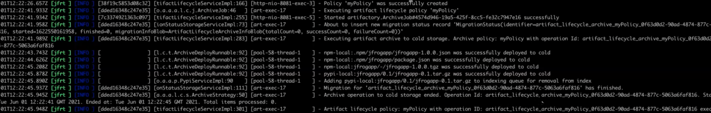
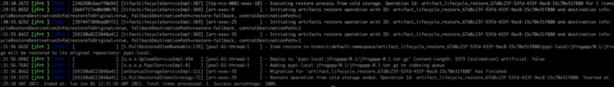
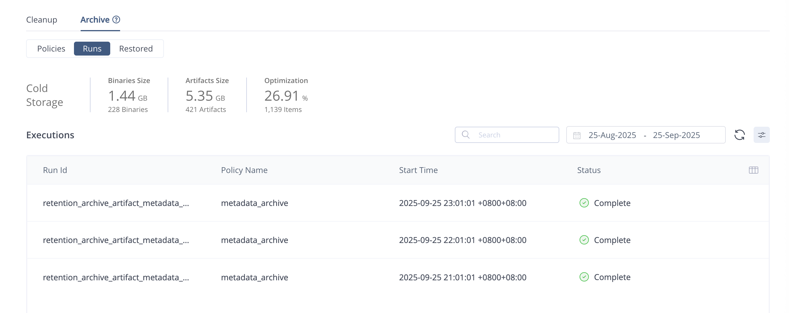

## JFrog 归档
官方 wiki  
https://jfrog.com/help/r/jfrog-platform-administration-documentation/archive

### Cold 归档
This feature is supported on the Self-Hosted platform, with an Enterprise X or Enterprise+ license.

#### 注意事项
⚠️ 冷库不推荐归档联邦仓库，归档后的联邦仓库制品，会自动重新创建。  
⚠️ 一个 Cold Artifactory 实例只能连接到一个 Live Artifactory HA。每个需要进行归档的 Artifactory 集群都需要一个单独的 Cold Artifactory 实例。  
⚠️ 只有系统管理员和项目管理员才可以创建归档策略。
⚠️ 只有系统管理员才可执行归档。
⚠️ 只有系统管理员才可查看归档制品并且恢复归档制品。

#### 功能要点
1. 恢复是一个非破坏性的过程，所恢复的制品均不会从冷库实例中删除。
2. 在单次运行过程中，可恢复的默认最大文件数量为 30k。不过，此值可以通过在 Artifactory System Properties 中的“retention.warm.restore.artifact.limit”属性中进行配置来提高或降低。在恢复过程中，如果文件数量超过最大限制，恢复过程会在完成对最大限制的文件的恢复后终止，并记录终止的原因。

#### Live Cold Artifactory 建立连接（TBD）
。。。。。。

#### 日志与监控
1. 如果已对邮件服务器进行了配置，那么在归档策略执行完毕后，系统会向管理员发送通知。恢复完毕后也会收到邮件通知。
2. 归档日志（Live Artifactory 的 artifactory-service.log）
- 制定存档策略
- 执行归档策略操作
- 完成策略执行的归档工作，其中包括以下信息：
    - 二级分类关于此次执行的简要概述，包括该过程开始和结束的时  间以及成功率的相关信息。
    - 已处理的总件数、成功归档的件数以及未能归档的件数
    - 每个已归档的工件或包的状态

Live Artifactory 的 artifactory-service.log 
归档完成后，日志会以以下为前缀结束：  
retention_archive_artifact  
retention_archive_package  

3. 恢复制品日志（Cold Artifactory 的 artifactory-service.log）  
- 开始恢复过程：每次恢复过程启动时，都会生成日志，其中包含恢复过程的大小、所涉及的工件或包的数量以及大致的恢复完成时间。
- 完成恢复过程
- 每个已恢复对象的状态

Cold Artifactory 的 artifactory-service.log  
恢复完成后，日志会以以下为前缀开始：  
retention_restore_artifact_  
retention_restore_package_  

4. UI 监控  
Runs 和 Restored 监控

#### 归档参数优化 
优化参数配置官方 wiki  
https://jfrog.com/help/r/jfrog-platform-administration-documentation/optimize-cold-storage-performance

