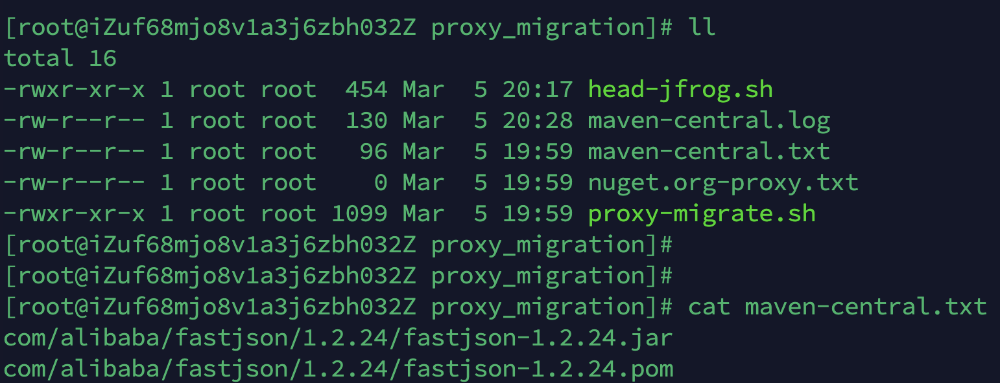
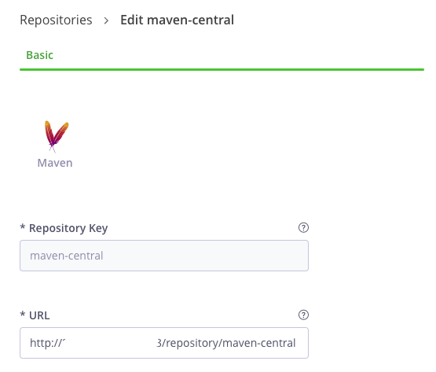
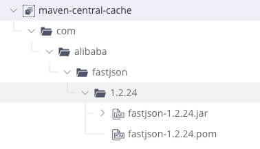
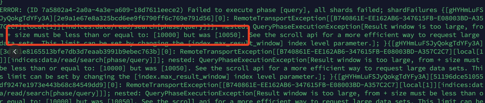

## 概述
目前 JFrog 官方 nexus 迁移脚本工具无法迁移 nexus proxy 类型的制品。该项目可实现迁移 nexus proxy 类型的仓库。

## 操作步骤
### 1. proxy-migrate.sh 
用于获取每个 proxy 仓库的制品文件路径

执行 proxy-migrate.sh 所在服务器确保可以访问 nexus 访问地址

修改 proxy-migrate.sh
将 nexus 所有 proxy 仓库输入到 proxy_repo 变量中。

执行 proxy-migrate.sh 在脚本所在目录会生成所有 proxy 仓库对应的文件列表，里面收集的制品路径。



### 2. 调整 Artifactory remote 仓库配置
将 Artifactory 中对应的迁移目标 remote 仓库的 url 调整为 nexus 对应的 proxy 仓库地址，例如：  
Nexus proxy repo : maven-central  
Artifactory remote repo : maven-central  
URL 配置地址如下:  
http:// Nexus IP:Nexus Port/repository/maven-central



### 3. head-jfrog.sh
通过此脚本在 Artifactory remote 仓库获取 nexus proxy 仓库制品

将 nexus 所有 proxy 仓库输入到 proxy_repo 变量中。

将 Artifactory 设置为匿名访问，且待迁移的 remote 仓库具有 cache 权限

执行 head-jfrog.sh  
通过同目录生成的 proxy repo log 查看日志


ok 成功。

### 4. 还原 remote 仓库 url 
将 remote 仓库 url 地址还原为原有 nexus proxy 仓库代理的外网源地址。


### 5. Troubleshooting
Nexus 查询接口默认不支持超过 1W 制品量  
  

%nexus_home%/etc/fabric/elasticsearch.yml 添加以下配置：  
```
index.max_result_window: 50000  
```  
重启 Nexus
