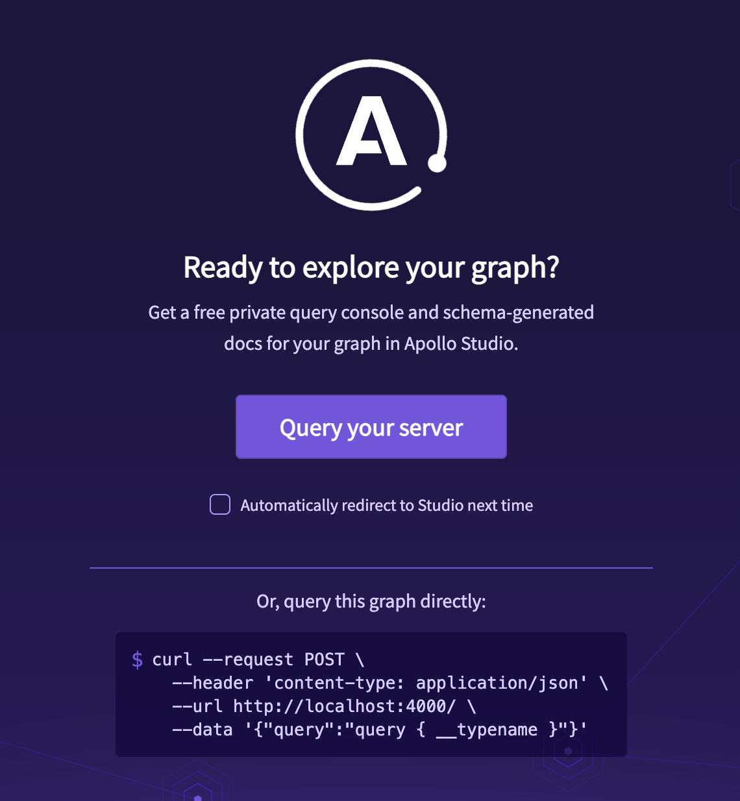
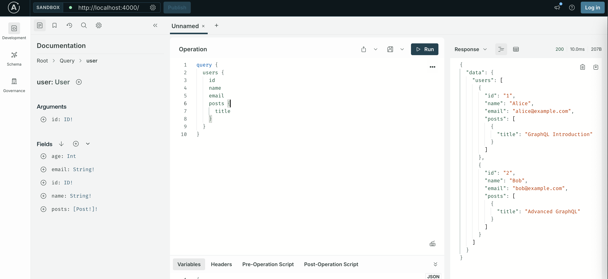

# GraphQL 服务端
本示例使用 Node.js + Apollo Server 作为服务端

安装、启动服务端
```
npm install apollo-server graphql
node server.js
```

打开 GraphQL Playground  
http://localhost:4000


可以通过 2 种方式测试使用 GraphQL 客户端
- curl 调用 api
- 点击【Query your server】直接通过 UI 界面输入 GraphQL 语句



# GraphQL 语句
```
# 查询所有用户及其帖子
query GetAllUsers {
  users {
    id
    name
    email
    age
    posts {
      id
      title
      published
    }
  }
}

# 查询特定用户
query GetUser($userId: ID!) {
  user(id: $userId) {
    id
    name
    email
    posts {
      id
      title
      content
    }
  }
}

# 嵌套查询
query GetPostsWithAuthors {
  posts {
    id
    title
    content
    author {
      id
      name
      email
    }
  }
}

# 复杂操作
mutation UpdateAndQuery {
  # 更新用户
  updateUser(id: "1", name: "Alice Updated", age: 26) {
    id
    name
    age
  }
  
  
  # 创建帖子
  createPost(title: "New Post", content: "Post content", authorId: "1") {
    id
    title
    author {
      name
    }
  }
}

# 创建用户
mutation {
  createUser(name: "Charlie", email: "charlie@example.com", age: 28) {
    id
    name
  }
}
```

