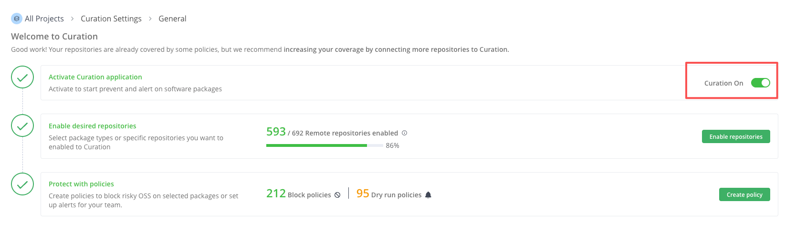
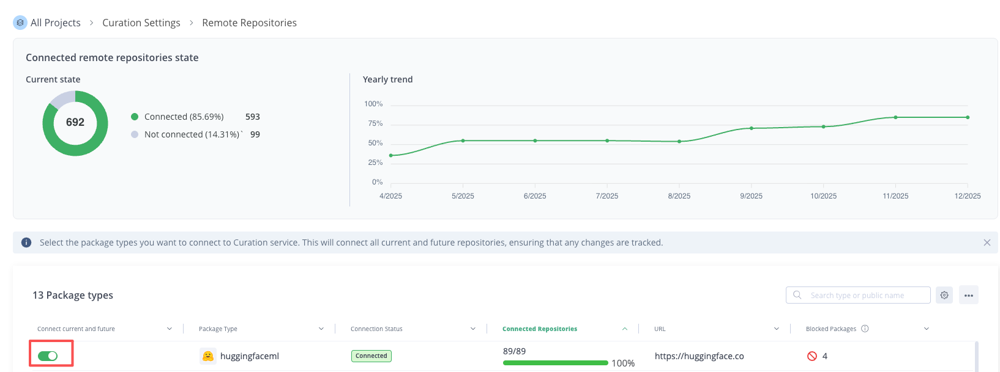
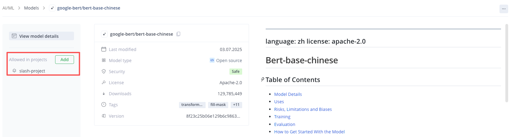
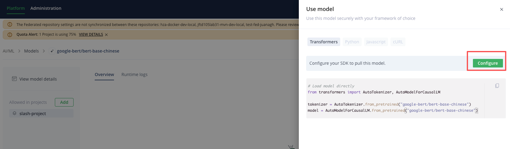
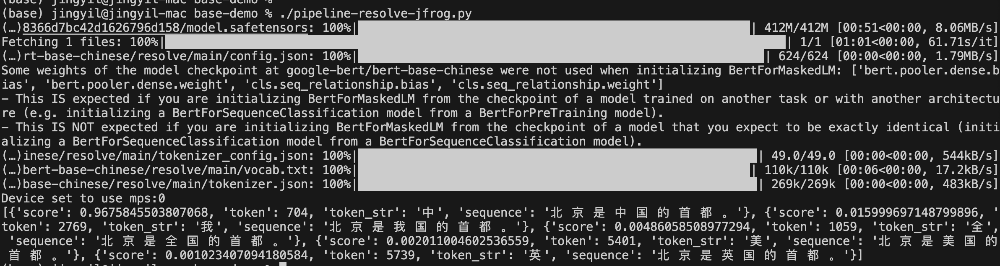
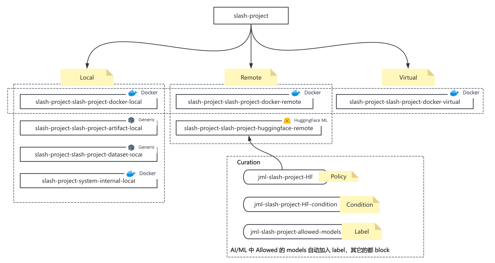
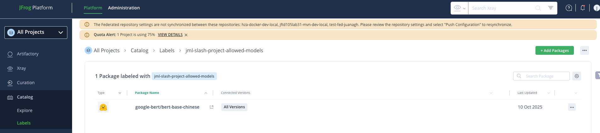

## AI Catalog
AI Catalog 功能基于 Project

## Quick start
### 1 创建 project
【Administration】->【Project Settings】  
例如创建项目 slash-project

### 2 Curation 全局配置
必须打开 Curation 的全局开关


确保 HuggingFaceML 类型 remote 开启


### 3 审计 model
【AI/ML】->【Discover AI Catalog】  
搜索可以使用的 model，例如 google-bert/bert-base-chinese  
点击 Add，将其添加到 project 


### 4 依赖下载 model
#### 4.1 配置 endpoint 和认证
在 model 页面点击允许的 project，点击【Use Model】,弹出页面后，再点击【Configure】查看具体使用 model 的配置方式。


```
export HF_HUB_ETAG_TIMEOUT=86400
export HF_HUB_DOWNLOAD_TIMEOUT=86400
export HF_ENDPOINT=https://<JPD_URL>/artifactory/api/huggingfaceml/slash-project-slash-project-huggingface-remote
export HF_TOKEN=<access_token>
```

#### 4.2 执行示例代码

``` 
cd jpd-dev/mlops/base-demo/  
./pipeline-resolve-jfrog/py  
```


## 系统逻辑
Allow 一个 model 后，JPD 会自动生成如下所示仓库及 Curation policy 等等内容。  


model 会自动加入到允许的 label 中（label 也是自动创建的）  
可以通过 Catalog -> Labels 查看  



