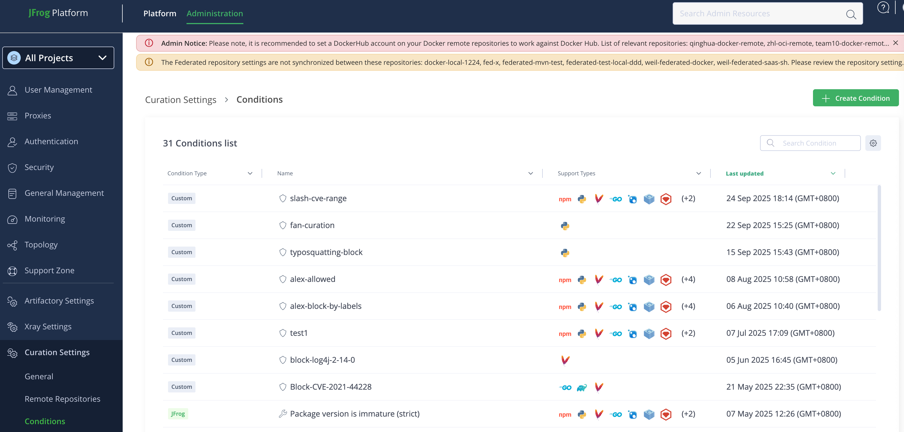
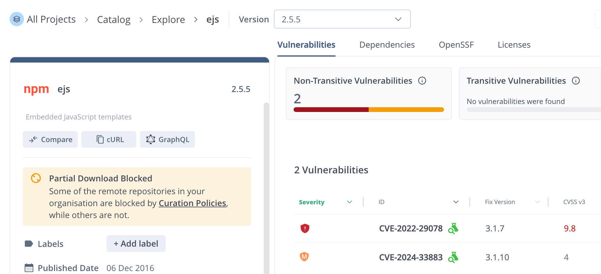
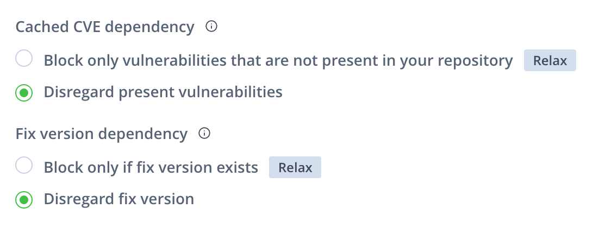
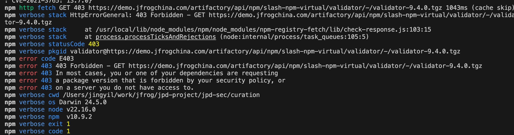
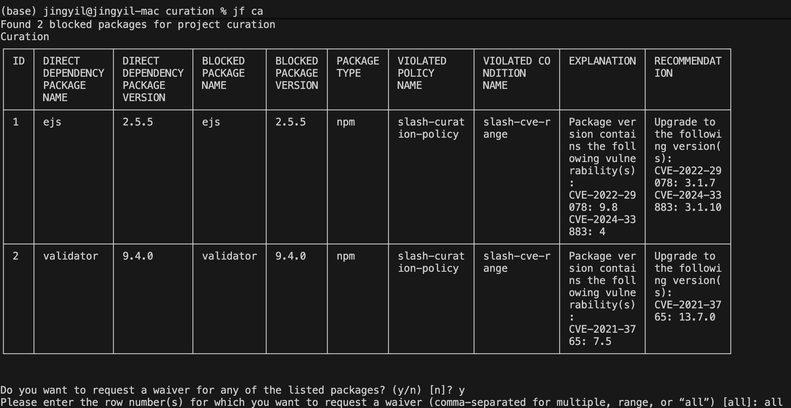
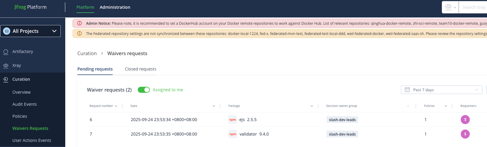
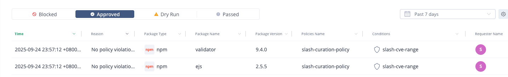
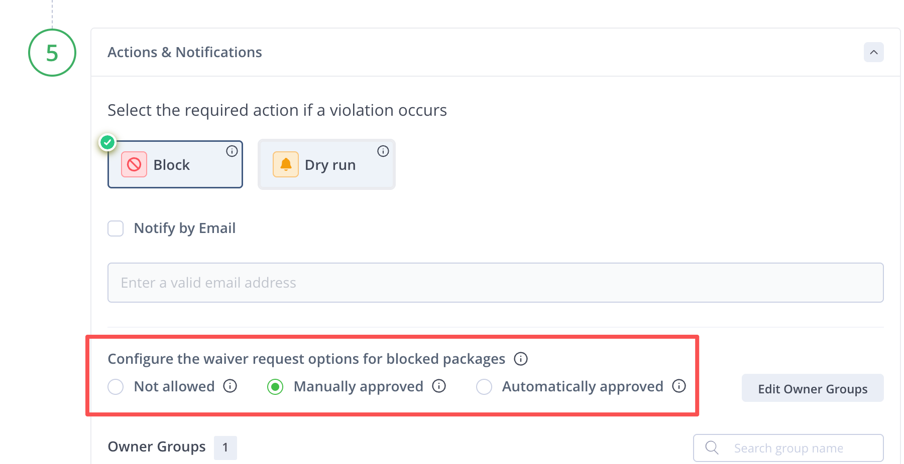

## 1. Curation 功能说明
Demo 环境：  
https://demo.jfrogchina.com

Demo 仓库：  
slash-npm-curation-remote

Demo Curation Policy:  
slash-curation-policy

### 1.1 通过自定义安全策略（Curation Custom Condition）方式管理中央源组件



#### 1.1.1 CVSS score range
Custom Condition：slash-cve-range  
Demo 漏洞组件：ejs-2.5.5


Dependency 策略设置：


策略配置 block 情况下，验证结果如下：

| slash-npm-curation-remote-cache <br> 是否已缓存 ejs-2.5.5 | Cached CVE dependency | npm install ejs@2.5.5 --loglevel verbose | Audit Events |
|-------|-------|-------|-------|
| 是 | Block only vulnerabilities that are not present in your repository | ok 200 | 无记录 |
|  | Disregard present vulnerabilities | ok 200 | 无记录 |
| 否 | Block only vulnerabilities that are not present in your repository | 403 | Blocked |
|  | Disregard present vulnerabilities | 403 |  Blocked |

⚠️ 问题记录：  
感觉 Cached CVE dependency 的选项配置并没有生效。

### 1.2 豁免 Waivers（白名单）
将 Demo 漏洞组件：ejs-2.5.5 配置成 Waivers


再执行 npm install 则不会再 block

### 1.3 审批流
针对 Block，管理员可以配置是否允许开发者申请审批流程

Step 1: 开发执行依赖构建，由于配置了 block，因此报错 403，无法下载
```
npm install --loglevel verbose
```



Step 2: 开发查看哪些组件被 block，并可提出申请（管理员在未选择 Not Allowed 前提下）
```
jf ca
```


Step 3: 被分配到审批权限的审批人可以进行手动审批


申请的开发者会收到申请结果邮件


Step 4: 开发人员再次执行通过


备注：只有在选择【Manually approved】才可进行手动审批流


