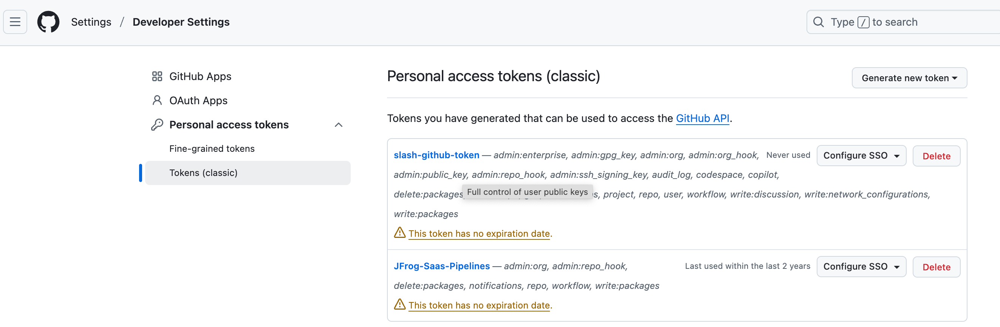

## Frogbot
### frogbot-config.yml
- 这个配置文件不是必选项。  
- 如果项目未使用“frogbot-config.yml”文件，那么 Frogbot 所需的全部配置信息都应以变量的形式包含在 Frogbot 的 pipeline 中。

### 获取 Github Token
1. 登录 GitHub  
访问 github.com 并登录您的账户

2. 进入 Settings（设置）  
点击右上角头像 → 选择 Settings；  

3. 找到 Developer settings（开发者设置）  
滚动到页面底部，点击 Developer settings

4. 选择 Personal access tokens（个人访问令牌）  
点击 Personal access tokens → Tokens (classic)  
生成新 Token
点击 Generate new token → Generate new token (classic)

5. 配置 Token 权限  
Note: 填写描述（如 "Jenkins CI" 或 "Frogbot Access"）  
Expiration: 设置过期时间（建议选择合适期限）
Select scopes: 根据需求选择权限

