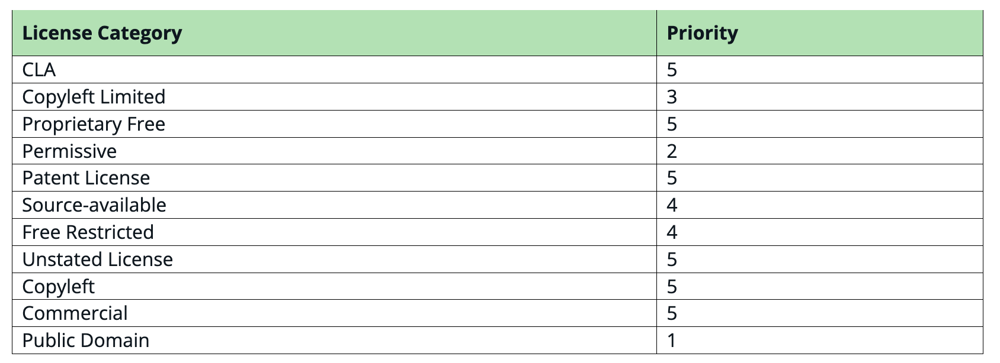
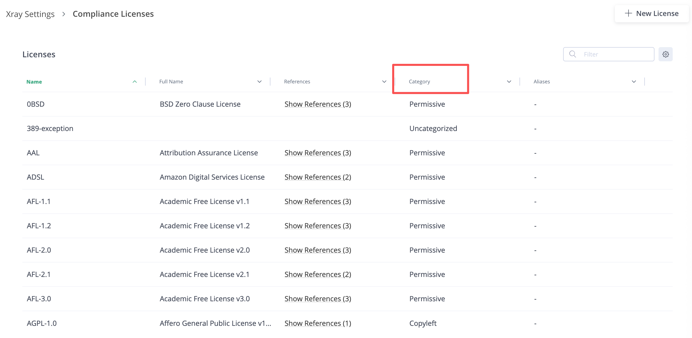
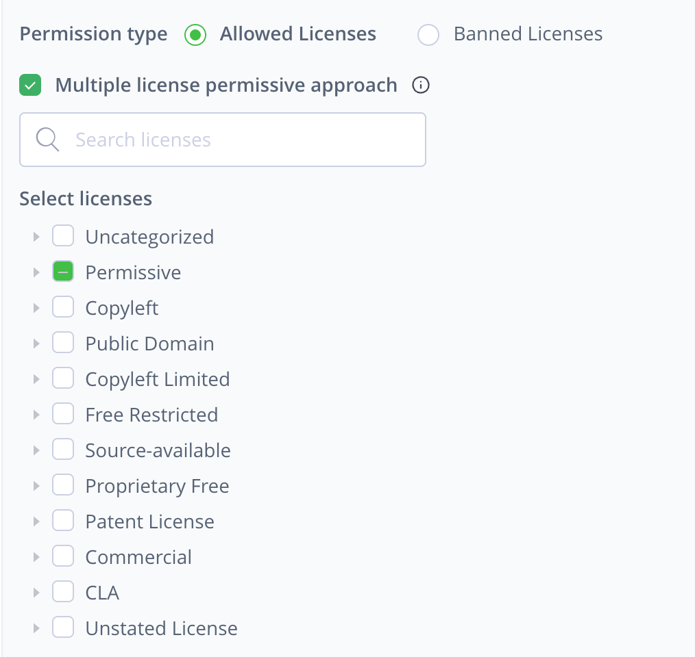
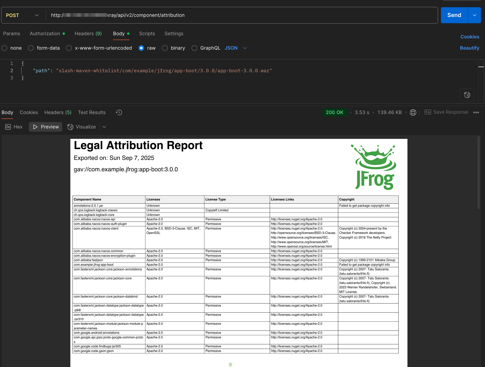

## License Conclusion
### 功能说明
版本：Xray version 3.124.x +  
允许用户为特定的软件依赖项确定最终的、权威的许可信息，通过 license 优先级评分的方式，可以自动或手动完成，且无需删除原先声明的许可信息。

### Benefits
- 通过区分已声明的许可证和已确定的许可证，提高了法律的清晰度
- 为合规团队提供更准确的报告和审计准备支持
- 使能够更好地传达某一特定制品的实际综合许可情况

### 默认 license 优先级
评分越低使用风险越低  

### 设置优先级
[Set License 优先级](https://jfrog.com/help/r/xray-rest-apis/set-license-priority?tocId=qdVgd9S6QxWCQi~iwrxpkw)  
POST /api/v1/licensesNames/priorities

[Get License](https://jfrog.com/help/r/xray-rest-apis/legal)  
GET /api/v1/licensesNames  

### UI
License 列表有一列 Category，

在 policy license rule 配置卡中可以通过 Category 批量选择 license  

## License Attribution Report
License Category 报告的必备条件：
- 安装 Catalog 服务
- 在 Xray 中 system.yaml 设置功能标志 sbom.retrieveCopyrightsFromCatalog: "true"
- 仅支持 REST API：

目前支持的制品类型：
- NPM
- Maven
- Go (Golang)
- PyPI (Python)
- NuGet（Upcoming）

API  
POST api/v2/component/attribution

以上 pdf 示例参考 ./license/attribution_report_app-boot_3.0.0.pdf

