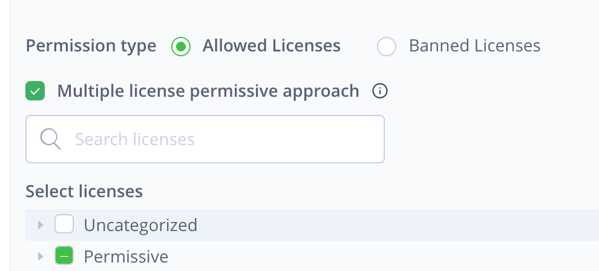

## Multiple license permissive approach
bug

I test the "Multiple license permissive approach" check box.
I have an war artifact, it has multiple licenses includes MIT, Apache 2.0, GPL-2.0, etc.
I config the rule which is allowed MIT, and check the box "Multiple license permissive approach".
I understand that if the "war" package has the MIT license, then a "violation" should not be generated. However, it still generated. So I'm not sure if the problem lies in my understanding or the functionality.

